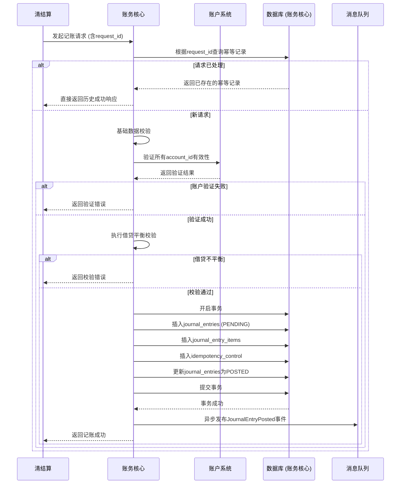

# 模块设计: 账务核心

生成时间: 2026-01-22 17:47:51
批判迭代: 2

---

# 账务核心模块设计文档

## 1. 概述
- **目的与范围**: 本模块负责记录所有资金变动相关的会计分录，是资金流水的核心记账中心。其职责包括但不限于记录收单记账、结算记账、分账记账等业务产生的资金变动凭证，确保账务数据的准确性、完整性和可追溯性。模块的核心边界是接收上游记账指令，执行必要的业务规则校验（如复式记账法），生成并持久化会计分录。模块不负责账户余额的实时计算与更新，也不执行实际的资金扣减或增加操作。

## 2. 接口设计
- **API端点 (REST)**: TBD
- **请求/响应结构**:
    - **请求体示例 (记账请求)**:
      ```json
      {
        "request_id": "unique_request_id_123", // 幂等键
        "business_type": "SETTLEMENT", // 业务类型，如分账、结算、退货
        "transaction_ref": "order_20240401001", // 关联业务单号
        "institution_id": "inst_001", // 机构号
        "entries": [
          {
            "account_id": "acc_01_merchantA",
            "amount": 100.00,
            "direction": "DEBIT" // 借贷方向：DEBIT/CREDIT
          },
          {
            "account_id": "acc_04_merchantA",
            "amount": 100.00,
            "direction": "CREDIT"
          }
        ],
        "metadata": {
          "operator": "system",
          "channel": "clearing"
        }
      }
      ```
    - **成功响应体**:
      ```json
      {
        "code": "SUCCESS",
        "message": "记账成功",
        "data": {
          "journal_entry_id": "je_202404010001",
          "status": "POSTED",
          "posted_at": "2024-04-01T10:00:00Z"
        }
      }
      ```
    - **失败响应体**:
      ```json
      {
        "code": "VALIDATION_ERROR",
        "message": "借贷金额不平衡",
        "details": {}
      }
      ```
- **发布/消费的事件**:
    - **消费事件**: TBD (例如，监听来自清结算模块的记账指令事件)
    - **发布事件**: `JournalEntryPosted` (会计分录已记账事件)，包含分录ID、业务单号、账户、金额等信息，供下游模块（如对账单系统）订阅。

## 3. 数据模型
- **表/集合**:
    1.  **journal_entries (会计分录主表)**
        - `id` (主键): 会计分录唯一标识。
        - `request_id`: 上游请求的幂等键，唯一索引。
        - `business_type`: 业务类型 (如 `SPLIT_ACCOUNT`, `SETTLEMENT`, `REFUND`)。
        - `transaction_ref`: 关联的业务交易参考号 (如订单号、结算批次号)。
        - `institution_id`: 机构号。
        - `status`: 状态 (`PENDING`, `POSTED`, `FAILED`, `COMPENSATED`)。
        - `total_debit`: 总借方金额。
        - `total_credit`: 总贷方金额。
        - `posted_by`: 记账操作者。
        - `posted_at`: 记账时间。
        - `created_at`: 记录创建时间。
    2.  **journal_entry_items (会计分录明细表)**
        - `id` (主键): 分录明细ID。
        - `journal_entry_id` (外键): 关联的会计分录ID。
        - `account_id`: 账户ID (需与账户系统保持一致)。
        - `amount`: 变动金额。
        - `direction`: 借贷方向 (`DEBIT`, `CREDIT`)。
        - `sequence`: 在同一分录中的顺序。
    3.  **idempotency_control (幂等控制表)**
        - `request_id` (主键): 请求幂等键。
        - `journal_entry_id`: 已成功处理的会计分录ID。
        - `processed_at`: 处理时间。
        - `response_snapshot`: 响应快照 (JSON格式)，用于直接返回重复请求的结果。
- **关键字段说明**:
    - `request_id`: 确保来自同一业务请求的重复调用不会导致重复记账。
    - `account_id`: 引用账户系统中的账户标识，记账前需验证其有效性。
    - `total_debit` 与 `total_credit`: 用于在应用层和数据库层（通过CHECK约束）强制保证借贷平衡。
- **与其他模块的关系**:
    - **清结算**: 主要上游，发起绝大部分记账请求。
    - **账户系统**: 作为只读依赖，用于在记账前验证 `account_id` 的有效性（账户是否存在、状态是否正常）。不直接接收其记账指令。
    - **对账单系统**: 主要下游，通过查询本模块的明细数据生成各类对账单。
    - **业务核心**: TBD (可能需要提供交易上下文信息，或消费业务核心的事件以触发记账)。

## 4. 业务逻辑
- **核心工作流/算法**:
    1.  **接收与校验**: 接收上游请求，首先进行基础数据校验（格式、必填项）。
    2.  **幂等性检查**: 使用 `request_id` 查询幂等控制表。若已存在成功记录，则直接返回存储的响应快照，流程结束。
    3.  **账户验证**: 调用**账户系统**的只读接口，验证请求中所有 `account_id` 的有效性和可用状态。
    4.  **借贷平衡校验**: 计算请求中所有明细的借方总额和贷方总额，必须相等。
    5.  **生成与存储分录**: 在一个数据库事务中：
        a. 插入 `journal_entries` 记录，状态为 `PENDING`。
        b. 插入 `journal_entry_items` 记录。
        c. 插入 `idempotency_control` 记录。
        d. 更新 `journal_entries` 状态为 `POSTED`。
    6.  **发布事件**: 事务成功后，异步发布 `JournalEntryPosted` 事件。
- **业务规则与验证**:
    - **复式记账法**: 强制每笔会计分录必须至少包含一借一贷，且借贷总额相等。
    - **幂等性**: 基于 `request_id` 实现，确保业务层面的请求仅被处理一次。
    - **关联性**: 必须记录 `transaction_ref` 和 `institution_id`，确保所有账务记录可追溯至具体业务和机构。
- **并发控制**:
    - 针对同一账户的并发记账请求，通过数据库事务的隔离级别（如 `READ COMMITTED`）和行级锁来保证数据一致性。
    - 在应用层，对关键操作（如幂等检查、插入分录）进行适当的锁或乐观锁控制，防止并发请求导致状态不一致。
- **关键边界情况处理**:
    - **重复请求**: 通过幂等性检查拦截。
    - **账户无效**: 在账户验证阶段失败，立即返回错误，不进行任何持久化操作。
    - **系统故障**: 在事务提交前发生故障，事务回滚，数据保持一致性。需由上游根据失败响应决定是否重试。

## 5. 时序图


## 6. 错误处理
- **预期错误情况**:
    1.  **客户端错误 (4xx)**: 请求数据格式错误、必填字段缺失、借贷金额不平衡、账户验证失败。
    2.  **服务器错误 (5xx)**: 数据库连接失败、事务提交失败、依赖服务（账户系统）不可用、消息队列发布失败。
- **处理策略**:
    - **立即失败**: 对于数据校验、业务规则校验（如借贷不平衡、账户无效）失败，立即返回明确的错误信息，不进行重试。
    - **重试机制**: 对于网络抖动、数据库死锁等瞬时系统错误，采用指数退避策略进行有限次重试（如最多3次）。
    - **补偿机制**: 对于已记账但因后续步骤（如事件发布）失败而整体标记为失败的情况，设计后台补偿任务，定期扫描状态异常的分录，尝试完成后续操作或进行人工干预。
    - **死信队列**: 对于重试多次仍失败的请求（如因账户系统长时间不可用），将请求信息转入死信队列，并触发告警，供运维人员排查。
    - **日志与监控**: 所有错误，无论等级，均需记录结构化日志，包含请求ID、错误码、堆栈信息。设置关键指标监控（如记账失败率、平均处理时长）。

## 7. 依赖关系
- **上游模块**:
    - **清结算**: **主要依赖**。发起记账请求的核心上游，需确保其传递正确的业务数据、账户信息和唯一的 `request_id`。
    - **账户系统**: **只读依赖**。用于记账前的账户有效性验证。本模块不直接修改账户余额。
- **下游模块**:
    - **对账单系统**: **主要服务对象**。通过查询本模块的明细数据，或订阅 `JournalEntryPosted` 事件，来生成和核对各类对账单。
    - **业务核心**: TBD (关系待明确，可能是数据提供方或事件消费者)。
- **外部依赖**:
    - 数据库 (PostgreSQL/MySQL)
    - 消息队列 (Kafka/RocketMQ) - 用于事件发布
    - 账户系统只读API