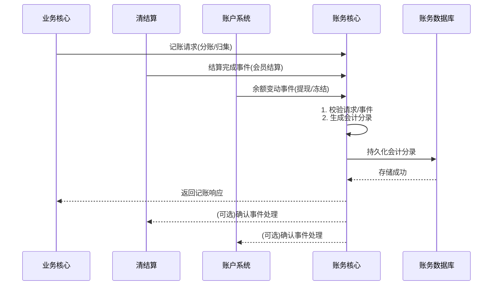

# 模块设计: 账务核心

生成时间: 2026-01-22 16:11:07
批判迭代: 2

---

# 账务核心模块设计文档

## 1. 概述
- **目的与范围**: 本模块负责记录所有资金变动的会计分录和记账，是资金流转的最终记录层。其核心职责是接收来自上游系统（如账户系统、清结算）的资金操作指令，生成准确、完整的会计流水，确保账务数据的一致性和可追溯性。其边界在于处理记账请求、维护账务流水，不涉及账户余额的直接管理或业务逻辑的校验。

## 2. 接口设计
- **API端点 (REST)**: TBD
    - 示例：`POST /api/v1/accounting/entries` 用于接收记账指令。
- **请求/响应结构**: TBD
    - 请求体应包含：业务流水号、机构号、业务类型（分账/归集/会员结算/提现等）、账户信息（付方账户、收方账户）、金额、幂等键等。
    - 响应体应包含：处理状态、账务流水号、错误码（如有）。
- **发布/消费的事件**: TBD
    - 消费来自"清结算"的结算完成事件，触发记账。
    - 消费来自"账户系统"的余额变动事件，触发记账。
    - 发布账务记录完成事件，供"对账单系统"消费。

## 3. 数据模型
- **表/集合**: TBD
    - 核心账务流水表（accounting_ledger）
- **关键字段**: TBD
    - 账务流水号、机构号、业务流水号、业务类型（分账/归集/会员结算/提现/冻结等）、付方账户号、付方账户类型（01/04/天财收款账户等）、收方账户号、收方账户类型、借贷方向、金额、关联账户类型、时间戳（创建、更新）、幂等键、对账标识。
- **与其他模块的关系**: 本模块的账务流水记录与账户系统的账户余额变动、清结算系统的结算结果、业务核心的交易数据存在强关联，通过业务流水号、账户号等关键字段进行关联追溯。

## 4. 业务逻辑
- **核心工作流/算法**: 接收记账请求，根据借贷记账法规则，将一笔业务资金变动拆分为一条或多条借贷平衡的会计分录，并持久化存储。
    - **分账/归集**: 付方账户（天财收款账户）记"贷"，收方账户（天财收款账户或天财接收方账户）记"借"。
    - **会员结算**: 待结算账户（01账户）记"贷"，品牌/门店对应的天财收款账户记"借"。
    - **提现**: 付方账户（天财收款账户或天财接收方账户）记"贷"，系统外部银行账户（或中间过渡账户）记"借"。
    - **退货**: 退货账户（04账户）记"贷"，目标天财收款账户记"借"。
    - **冻结/解冻**: 记录资金状态变更，不改变借贷总额。
- **业务规则与验证**:
    - 确保每笔会计分录的借贷总额相等。
    - 根据业务类型，验证关联账户类型的合法性（如分账的付方必须是天财收款账户）。
    - 通过幂等键（如业务流水号）保证重复请求的幂等性。
- **关键边界情况处理**: 处理重复记账请求的幂等性；在分布式事务场景下，确保账务记录与上游业务状态的一致性。

## 5. 时序图

## 6. 错误处理
- **预期错误情况**: 记账请求数据格式错误；数据库连接或写入失败；生成会计分录时借贷不平衡；账户类型与业务类型不匹配；幂等键冲突。
- **处理策略**: 对格式错误立即返回失败；对持久化失败进行重试并告警；对借贷不平衡或业务规则校验失败的请求拒绝处理并记录异常；幂等键冲突时返回已存在的成功结果。

## 7. 依赖关系
- **上游模块**: 账户系统（触发余额变动的记账）、清结算（推送结算结果触发记账）、业务核心（交易数据触发记账）。
- **下游模块**: 对账单系统（依赖账务流水生成对账文件）。