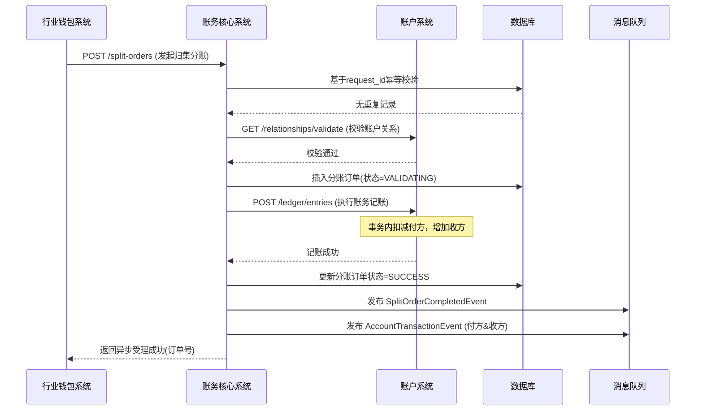
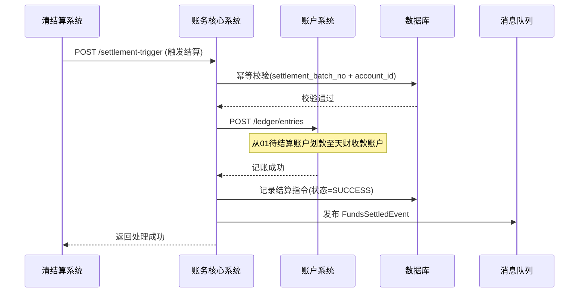

# 模块设计: 账务核心系统

生成时间: 2026-01-19 15:31:07

---

# 账务核心系统模块设计文档

## 1. 概述

### 1.1 目的
本模块作为天财分账业务的账务处理核心，负责处理所有与天财专用账户相关的资金流转、记账、结算、分账等核心账务操作。它向上承接行业钱包系统的业务指令，向下调用账户系统的底层账务能力，确保资金变动的准确性、一致性、可追溯性和合规性。本模块是天财分账业务资金流的核心引擎。

### 1.2 范围
- **分账指令处理**：接收并处理行业钱包系统发起的各类分账指令（归集、批量付款、会员结算），完成资金从付方账户到收方账户的划转。
- **结算处理**：与清结算系统协同，处理收单交易资金的结算流程，将待结算账户（01账户）的资金划入指定的天财收款账户。
- **退货资金处理**：处理涉及天财收款账户的退货场景，协调退货账户（04账户）与天财收款账户之间的资金调拨。
- **账务流水与对账**：生成所有资金变动的明细流水，为对账单系统提供数据源，并支持内部对账与差错处理。
- **资金操作校验**：在执行任何资金操作前，对账户状态、关系、余额、业务规则进行严格校验。
- **事务与一致性保障**：确保所有跨账户、跨系统的资金操作在分布式环境下的最终一致性。

## 2. 接口设计

### 2.1 API端点 (RESTful)

#### 2.1.1 分账指令接口
- **POST /api/v1/tiancai/split-orders**
    - **描述**：接收并执行天财分账指令。这是核心业务接口。
    - **请求体**：
      ```json
      {
        "request_id": "split_req_20250120001", // 请求流水号，全局唯一，用于幂等
        "biz_scene": "COLLECTION", // 业务场景：COLLECTION(归集)/BATCH_PAY(批量付款)/MEMBER_SETTLE(会员结算)
        "payer_account_id": "TCA_20231011001", // 付方天财账户ID
        "payee_account_id": "TCA_20231011002", // 收方天财账户ID
        "amount": 100000, // 分账金额（单位：分）
        "currency": "CNY",
        "biz_ref_no": "ORDER_REF_001", // 业务参考号（如订单号），用于关联业务
        "remark": "门店日终归集",
        "ext_info": { // 扩展信息，根据场景不同
          "split_ratio": 0.3, // 分账比例（批量付款可能用到）
          "fee_deduct_info": {...} // 手续费扣收信息（如有）
        }
      }
      ```
    - **响应体**：
      ```json
      {
        "code": "SUCCESS",
        "message": "分账指令接收成功",
        "data": {
          "split_order_no": "TSO_2025012000001", // 系统生成的分账订单号
          "request_id": "split_req_20250120001",
          "status": "PROCESSING", // 状态：PROCESSING(处理中)/SUCCESS/FAILED
          "estimated_settle_time": "2025-01-20T15:30:00Z" // 预计完成时间
        }
      }
      ```
    - **说明**：此接口为异步处理，立即返回受理结果。实际账务处理通过内部流程完成。

#### 2.1.2 结算触发接口
- **POST /api/v1/tiancai/settlement-trigger**
    - **描述**：由清结算系统调用，触发将待结算账户资金结算至天财收款账户。
    - **请求体**：
      ```json
      {
        "request_id": "settle_req_001",
        "settlement_batch_no": "SETTLE_20250120_01", // 清结算批次号
        "merchant_no": "M100001",
        "tiancai_receive_account_id": "TCA_20231011001", // 目标天财收款账户ID
        "total_amount": 5000000, // 结算总金额（分）
        "currency": "CNY",
        "settlement_date": "2025-01-20", // 结算日期
        "detail_items": [ // 可选的明细列表，用于对账
          {
            "trade_no": "TRADE_001",
            "amount": 100000,
            "fee": 500
          }
        ]
      }
      ```
    - **响应体**：返回受理结果及系统生成的结算指令号。

#### 2.1.3 退货资金处理接口
- **POST /api/v1/tiancai/refund-adjustment**
    - **描述**：处理涉及天财收款账户的退货，调整退货账户（04）与天财收款账户的资金。
    - **请求体**：
      ```json
      {
        "request_id": "refund_adj_001",
        "refund_trade_no": "REFUND_20250120001",
        "original_trade_no": "TRADE_001", // 原交易号
        "tiancai_receive_account_id": "TCA_20231011001", // 关联的天财收款账户
        "refund_amount": 50000, // 退货金额（分）
        "currency": "CNY",
        "adjustment_type": "DIRECT_DEDUCT", // 调整类型：DIRECT_DEDUCT(直接扣减)/FUND_TRANSFER(资金划转)
        "reason": "客户取消订单"
      }
      ```
    - **响应体**：返回处理结果。

#### 2.1.4 查询接口
- **GET /api/v1/tiancai/split-orders/{split_order_no}**：查询分账指令状态及详情。
- **GET /api/v1/tiancai/accounts/{tiancai_account_id}/transactions**：查询账户交易流水。
- **POST /api/v1/tiancai/internal/reconciliation**：内部对账接口（日终批处理）。

### 2.2 发布/消费的事件

#### 2.2.1 消费的事件
- **TiancaiAccountCreatedEvent** (来自账户系统)：监听天财账户创建，初始化本模块的账户缓存或路由信息。
- **AccountRelationshipBoundEvent** (来自账户系统)：更新本模块维护的关系映射，用于快速校验。
- **SettlementCompletedEvent** (来自清结算系统)：接收结算完成通知，触发后续分账或资金可用性更新。

#### 2.2.2 发布的事件
- **TiancaiSplitOrderCreatedEvent**：分账指令被成功接收并持久化后发布。
  ```json
  {
    "event_id": "event_split_created_001",
    "event_type": "TIANCAI_SPLIT_ORDER_CREATED",
    "timestamp": "2025-01-20T10:00:00Z",
    "data": {
      "split_order_no": "TSO_2025012000001",
      "biz_scene": "COLLECTION",
      "payer_account_id": "TCA_20231011001",
      "payee_account_id": "TCA_20231011002",
      "amount": 100000,
      "status": "PROCESSING"
    }
  }
  ```
- **TiancaiSplitOrderCompletedEvent**：分账指令处理完成（成功或失败）后发布，通知行业钱包系统和对账单系统。
- **FundsSettledEvent**：天财收款账户收到结算资金后发布，通知相关业务方资金已到位。
- **AccountTransactionEvent**：每笔账务变动（记账流水）完成后发布，包含详细的借贷信息，是对账单系统的核心数据源。

## 3. 数据模型

### 3.1 核心表设计

#### 表：`tiancai_split_order` (天财分账订单表)
| 字段名 | 类型 | 必填 | 默认值 | 描述 |
| :--- | :--- | :--- | :--- | :--- |
| `id` | bigint | Y | AUTO_INCREMENT | 主键 |
| `split_order_no` | varchar(32) | Y | | **业务主键**，分账订单号，格式`TSO_YYYYMMDDxxxxx` |
| `request_id` | varchar(64) | Y | | 请求流水号，用于幂等，全局唯一 |
| `biz_scene` | varchar(20) | Y | | 业务场景：`COLLECTION`/`BATCH_PAY`/`MEMBER_SETTLE` |
| `payer_account_id` | varchar(32) | Y | | 付方天财账户ID |
| `payee_account_id` | varchar(32) | Y | | 收方天财账户ID |
| `amount` | decimal(15,2) | Y | | 分账金额（元，存储用元） |
| `currency` | varchar(3) | Y | `CNY` | 币种 |
| `status` | varchar(20) | Y | `INIT` | 状态：`INIT`(初始)/`VALIDATING`(校验中)/`PROCESSING`(处理中)/`SUCCESS`/`FAILED`/`PARTIAL_SUCCESS`(部分成功-批付) |
| `biz_ref_no` | varchar(64) | N | | 业务参考号 |
| `remark` | varchar(256) | N | | 备注 |
| `failure_reason` | varchar(512) | N | | 失败原因 |
| `processed_at` | datetime | N | | 处理完成时间 |
| `created_at` | datetime | Y | CURRENT_TIMESTAMP | |
| `updated_at` | datetime | Y | CURRENT_TIMESTAMP ON UPDATE | |

#### 表：`account_transaction` (账户交易流水表)
| 字段名 | 类型 | 必填 | 默认值 | 描述 |
| :--- | :--- | :--- | :--- | :--- |
| `id` | bigint | Y | AUTO_INCREMENT | 主键 |
| `transaction_no` | varchar(32) | Y | | 交易流水号，格式`TXN_YYYYMMDDxxxxx` |
| `account_no` | varchar(20) | Y | | **账户号**（底层账户号） |
| `tiancai_account_id` | varchar(32) | Y | | 关联的天财账户ID |
| `biz_trade_no` | varchar(64) | Y | | 关联的业务交易号（如split_order_no, settlement_batch_no） |
| `biz_type` | varchar(30) | Y | | 业务类型：`TIANCAI_SPLIT`/`SETTLEMENT_IN`(结算入金)/`REFUND_ADJUSTMENT`/`WITHDRAW`(提现) |
| `direction` | varchar(10) | Y | | 方向：`CREDIT`(入账)/`DEBIT`(出账) |
| `amount` | decimal(15,2) | Y | | 交易金额（元） |
| `balance_before` | decimal(15,2) | Y | | 交易前余额 |
| `balance_after` | decimal(15,2) | Y | | 交易后余额 |
| `balance_type` | varchar(20) | Y | `AVAILABLE` | 余额类型：`AVAILABLE`/`FROZEN` |
| `currency` | varchar(3) | Y | `CNY` | |
| `status` | varchar(20) | Y | `SUCCESS` | 状态：`SUCCESS`/`FAILED` |
| `remark` | varchar(256) | N | | 备注 |
| `created_at` | datetime | Y | CURRENT_TIMESTAMP | |

#### 表：`settlement_instruction` (结算指令记录表)
| 字段名 | 类型 | 必填 | 默认值 | 描述 |
| :--- | :--- | :--- | :--- | :--- |
| `id` | bigint | Y | AUTO_INCREMENT | 主键 |
| `instruction_no` | varchar(32) | Y | | 结算指令号，系统生成 |
| `settlement_batch_no` | varchar(64) | Y | | 清结算系统批次号 |
| `tiancai_receive_account_id` | varchar(32) | Y | | 天财收款账户ID |
| `total_amount` | decimal(15,2) | Y | | 结算总金额 |
| `currency` | varchar(3) | Y | `CNY` | |
| `status` | varchar(20) | Y | `INIT` | 状态：`INIT`/`PROCESSING`/`SUCCESS`/`FAILED` |
| `settlement_date` | date | Y | | 结算日期 |
| `detail_count` | int | N | | 关联的交易明细笔数 |
| `processed_at` | datetime | N | | |
| `created_at` | datetime | Y | CURRENT_TIMESTAMP | |

#### 表：`internal_reconciliation` (内部对账表)
| 字段名 | 类型 | 必填 | 默认值 | 描述 |
| :--- | :--- | :--- | :--- | :--- |
| `id` | bigint | Y | AUTO_INCREMENT | 主键 |
| `recon_date` | date | Y | | 对账日期 |
| `account_type` | varchar(20) | Y | | 账户类型：`TIANCAI_RECEIVE`/`TIANCAI_RECEIVER` |
| `total_credit` | decimal(15,2) | Y | | 总入账金额 |
| `total_debit` | decimal(15,2) | Y | | 总出账金额 |
| `beginning_balance` | decimal(15,2) | Y | | 期初余额 |
| `ending_balance` | decimal(15,2) | Y | | 期末余额 |
| `calculated_balance` | decimal(15,2) | Y | | 计算余额（期初+入-出） |
| `balance_diff` | decimal(15,2) | Y | `0.00` | 差额（计算余额-期末余额） |
| `status` | varchar(20) | Y | `PENDING` | 状态：`PENDING`/`BALANCED`/`UNBALANCED` |
| `checked_at` | datetime | N | | 核对时间 |
| `created_at` | datetime | Y | CURRENT_TIMESTAMP | |

### 3.2 与其他模块的关系
- **行业钱包系统**：通过`tiancai_split_order`表记录其发起的业务指令，并通过事件通知其处理结果。
- **账户系统**：通过`account_transaction`表中的`account_no`关联底层账户流水，账务操作最终调用账户系统接口完成。
- **清结算系统**：通过`settlement_instruction`表记录结算触发指令，实现结算资金的可追溯。
- **对账单系统**：`account_transaction`表是其核心数据源，`internal_reconciliation`表支持其对账。

## 4. 业务逻辑

### 4.1 核心算法与规则

#### 4.1.1 分账指令处理流程
1. **指令接收与幂等**：基于`request_id`进行幂等校验，防止重复处理。
2. **业务校验**：
   - 调用账户系统接口，校验付方与收方账户状态是否为`ACTIVE`。
   - 调用账户系统关系校验接口，验证是否存在`VERIFIED`状态且有效的对应类型关系。
   - 校验付方账户可用余额是否充足（实时查询或缓存）。
   - 校验业务场景与账户角色的匹配性（如归集场景，付方必须是门店，收方必须是总部）。
3. **指令持久化**：校验通过后，将指令状态置为`VALIDATING`并持久化。
4. **账务执行**：
   - 调用账户系统账务操作接口(`POST /ledger/entries`)，使用`split_order_no`作为`biz_trade_no`。
   - 请求体构造借贷分录：付方账户`DEBIT`，收方账户`CREDIT`。
   - 账户系统在事务中完成双方余额更新。
5. **状态更新与通知**：
   - 账务成功：更新分账订单状态为`SUCCESS`，记录处理时间。
   - 账务失败：更新状态为`FAILED`，记录失败原因。
   - 发布`TiancaiSplitOrderCompletedEvent`和`AccountTransactionEvent`。

#### 4.1.2 结算资金处理流程
1. **触发接收**：接收清结算系统的结算触发请求，基于`settlement_batch_no`和`tiancai_receive_account_id`做幂等。
2. **资金划转**：
   - 确定源账户：待结算账户（01账户），根据`merchant_no`定位。
   - 确定目标账户：天财收款账户对应的底层账户。
   - 调用账户系统账务操作接口，完成从01账户到天财收款账户的资金划转。
3. **记录与通知**：记录结算指令，发布`FundsSettledEvent`，通知相关方资金已到账。

#### 4.1.3 批量付款特殊处理
- **拆分处理**：一个批量付款指令可能包含多个收款方。本模块接收的是单个付方对单个收方的指令。行业钱包系统负责拆分和组装。
- **部分成功**：在极端情况下，一个批量批次中部分成功、部分失败。`tiancai_split_order`表记录每笔明细，行业钱包系统需汇总状态。本模块支持`PARTIAL_SUCCESS`状态用于上游汇总。

#### 4.1.4 日终对账流程
1. **数据汇总**：每日凌晨，统计`account_transaction`表中当日所有交易，按账户类型汇总`CREDIT`和`DEBIT`总额。
2. **余额核对**：从账户系统获取各天财账户的日初和日末余额快照。
3. **差额计算**：计算`期初余额 + 总入账 - 总出账`是否等于`期末余额`。
4. **异常处理**：若差额不为零，触发告警，并生成差错处理工单，供运营人员核查。
5. **状态更新**：核对无误后，更新`internal_reconciliation`表状态为`BALANCED`。

### 4.2 验证逻辑
- **分账指令验证**：`业务场景`、`账户角色`、`关系有效性`、`余额充足性`四重校验。
- **结算触发验证**：校验`天财收款账户`是否存在且状态正常，校验`结算批次`是否已处理过（幂等）。
- **金额验证**：所有金额必须为正数，且符合币种精度要求。
- **事务边界**：任何涉及资金变动的操作，必须在一个明确的业务事务内，且有补偿或冲正机制。

## 5. 时序图

### 5.1 天财分账（归集）核心流程


### 5.2 收单资金结算至天财账户流程


## 6. 错误处理

| 错误码 | HTTP 状态码 | 描述 | 处理策略 |
| :--- | :--- | :--- | :--- |
| `SPLIT_REQUEST_DUPLICATE` | 409 | 重复的分账请求(request_id) | 返回已创建的分账订单信息，确保幂等。 |
| `ACCOUNT_RELATIONSHIP_INVALID` | 422 | 账户关系校验失败 | 拒绝分账，返回具体原因（无关系、已过期、类型不匹配）。 |
| `PAYER_BALANCE_INSUFFICIENT` | 422 | 付方余额不足 | 拒绝分账，通知调用方。 |
| `ACCOUNT_STATUS_ABNORMAL` | 423 | 付方或收方账户状态非ACTIVE | 拒绝分账，提示账户冻结或注销。 |
| `BIZ_SCENE_VALIDATION_FAILED` | 400 | 业务场景与账户角色不匹配 | 拒绝请求，例如门店向门店发起归集。 |
| `SETTLEMENT_BATCH_DUPLICATE` | 409 | 重复的结算触发请求 | 返回已处理的结算指令信息。 |
| `LEDGER_OPERATION_FAILED` | 500 | 底层账务操作失败 | 记录失败详情，更新分账订单状态为FAILED，发布失败事件。触发告警，需人工介入检查。 |
| `RECONCILIATION_UNBALANCED` | (内部) | 日终对账不平 | 触发高级别告警，冻结相关账户的异常交易，生成差错工单。 |

**通用策略**：
- **业务校验错误(4xx)**：立即失败，返回明确错误信息，不进行重试。
- **外部系统调用失败**：
  - 账户系统调用失败：根据错误类型决定。如果是网络超时等暂时性错误，进入重试队列（最多3次）。如果是账户状态等业务错误，立即失败。
  - 采用**SAGA模式**处理长事务：对于已调用账户系统记账但后续步骤失败的情况，有对应的冲正接口，保证最终一致性。
- **内部系统错误(5xx)**：记录完整错误日志和上下文，触发监控告警。对于异步处理的任务，移至死信队列，供人工排查。

## 7. 依赖说明

### 7.1 上游依赖
1. **行业钱包系统**
   - **交互方式**：同步REST API调用 (`POST /split-orders`)。
   - **职责**：发起所有分账业务请求，是业务规则的制定者和校验者（前置基础校验）。
   - **关键点**：本模块依赖其提供正确的业务场景、账户ID和金额。采用异步响应模式，通过事件回传处理结果。

2. **清结算系统**
   - **交互方式**：同步REST API调用 (`POST /settlement-trigger`)。
   - **职责**：在结算日触发资金从待结算账户转入天财收款账户。
   - **关键点**：依赖其提供准确的结算金额、批次号和商户信息。需保证幂等性处理。

3. **账户系统**
   - **交互方式**：同步REST API调用 (关系校验、账务操作)。
   - **职责**：提供账户状态、关系的最终校验，以及执行原子化的资金划转。
   - **关键点**：**强依赖**。账务操作必须成功，否则整个分账失败。需要设计良好的重试和补偿机制。

### 7.2 设计原则
- **职责清晰**：本模块聚焦于“账务处理”，不涉及业务签约、认证、规则计算等。
- **异步化与解耦**：核心资金处理虽需强一致性，但通过异步事件通知结果，与业务系统解耦。
- **幂等性设计**：所有写操作接口必须支持幂等，通过`request_id`、`biz_trade_no`等实现。
- **可观测性**：所有资金流转必须留下完整的双流水分录（交易流水），支持审计和对账。
- **最终一致性**：在分布式环境下，通过事件驱动和补偿交易（冲正）保证跨系统数据的最终一致性。