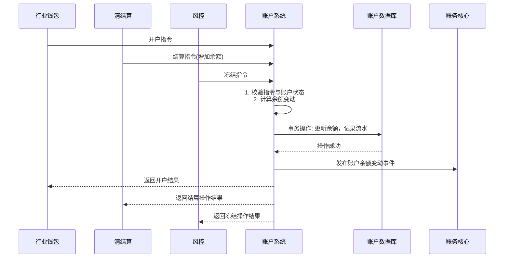

# 模块设计: 账户系统

生成时间: 2026-01-22 16:12:11
批判迭代: 1

---

# 账户系统模块设计文档

## 1. 概述
- **目的与范围**: 本模块负责账户的底层开户、余额管理、资金扣减/增加、冻结等核心账户操作。其核心职责是管理各类账户（如天财收款账户、天财接收方账户、待结算账户、退货账户）的生命周期和资金状态，为上层业务（如分账、归集、提现）提供原子化的资金操作能力。其边界在于处理账户的创建、查询、余额变动和状态变更，不涉及业务逻辑校验（如分账关系）和会计分录记录。

## 2. 接口设计
- **API端点 (REST)**: TBD
    - 示例：`POST /api/v1/accounts` 用于开户。
    - 示例：`POST /api/v1/accounts/{accountNo}/balance/operate` 用于资金操作。
    - 示例：`POST /api/v1/accounts/{accountNo}/freeze` 用于冻结/解冻。
- **请求/响应结构**: TBD
    - 资金操作请求体应包含：业务流水号、操作类型（增加/扣减）、金额、关联账户信息、幂等键等。
    - 开户请求体应包含：机构号、账户类型（天财收款账户/天财接收方账户等）、角色（总部/门店）、关联商户信息等。
- **发布/消费的事件**: TBD
    - 消费来自"行业钱包"的开户指令，完成底层账户创建。
    - 消费来自"清结算"的结算指令，执行账户余额增加或扣减。
    - 消费来自"风控"的冻结指令，执行账户资金冻结/解冻。
    - 发布账户余额变动事件，供"账务核心"消费以触发记账。
    - 发布账户状态变更事件，供相关系统感知。

## 3. 数据模型
- **表/集合**: TBD
    - 账户主表（account）
    - 账户余额表（account_balance）
    - 账户流水表（account_flow）
    - 账户冻结记录表（account_freeze）
- **关键字段**: TBD
    - 账户主表：账户号、机构号、账户类型（天财收款账户/天财接收方账户/01待结算账户/04退货账户）、角色（总部/门店）、状态（正常/冻结/注销）、关联商户ID、创建时间。
    - 账户余额表：账户号、可用余额、冻结余额、总余额。
    - 账户流水表：流水号、账户号、业务流水号、变动前余额、变动金额、变动后余额、变动类型（增加/扣减/冻结/解冻）、关联账户、时间戳。
    - 账户冻结记录表：冻结流水号、账户号、冻结金额、解冻金额、冻结状态、关联风控指令号。
- **与其他模块的关系**: 本模块的账户号与"行业钱包"的用户ID关联；账户流水与"账务核心"的会计分录通过业务流水号关联；账户状态与"风控"的指令关联。

## 4. 业务逻辑
- **核心工作流/算法**:
    - **开户流程**: 接收开户请求，根据账户类型和角色创建账户记录，初始化余额为0。
    - **资金操作流程**: 接收资金操作指令（如增加、扣减），校验账户状态和余额充足性（针对扣减和冻结），以事务方式更新账户余额并记录流水。
    - **冻结/解冻流程**: 接收冻结指令，将账户部分或全部可用余额转入冻结余额；接收解冻指令，执行反向操作。
- **业务规则与验证**:
    - 扣减或冻结操作前，必须校验账户可用余额是否充足。
    - 资金操作必须保证幂等性，通过业务流水号实现。
    - 根据账户类型限制操作：天财收款账户支持转账、分账、提现；天财接收方账户仅支持提现；待结算账户和退货账户仅接受系统内部划拨。
    - 状态为"冻结"或"注销"的账户禁止进行资金出账操作。
- **关键边界情况处理**: 处理并发资金操作时的余额一致性（通过数据库事务或乐观锁）；处理重复请求的幂等性；在分布式场景下，确保账户流水与余额变动的最终一致性。

## 5. 时序图

## 6. 错误处理
- **预期错误情况**: 开户请求数据不完整或格式错误；账户不存在或状态异常（冻结、注销）；扣减或冻结时余额不足；数据库操作失败（连接超时、死锁）；幂等键冲突。
- **处理策略**: 对参数错误立即返回失败；对余额不足的请求拒绝操作；对数据库操作失败进行有限次重试并告警；幂等键冲突时返回已存在的成功结果；所有失败均需记录详细日志。

## 7. 依赖关系
- **上游模块**: 行业钱包（提供开户指令）、清结算（提供结算指令）、风控（提供冻结指令）。
- **下游模块**: 账务核心（消费账户余额变动事件以记账）。