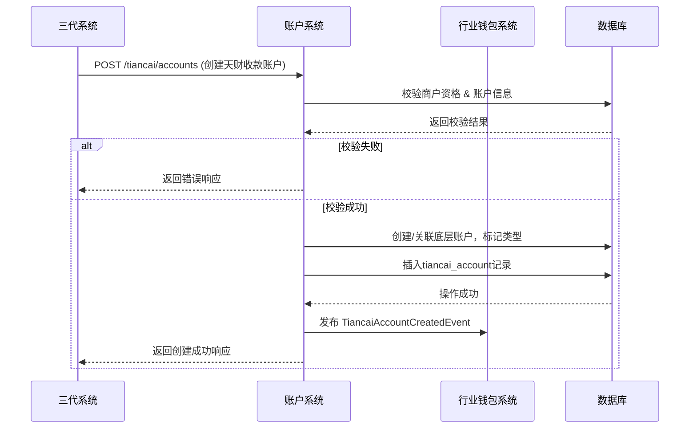
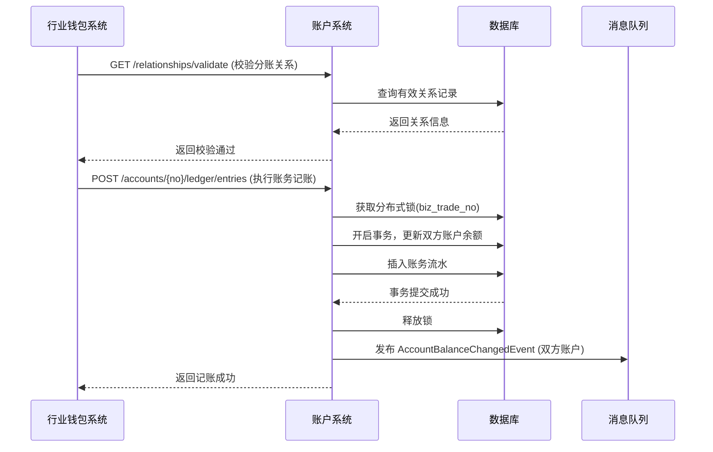

# 模块设计: 账户系统

生成时间: 2026-01-19 15:29:44

---

# 账户系统模块设计文档

## 1. 概述

### 1.1 目的
本模块作为底层账户管理核心系统，旨在为“天财分账业务”提供专用的账户创建、管理、标记、账务处理及能力控制服务。它是支撑天财专用账户（收款账户、接收方账户）生命周期管理、资金流转和业务规则校验的基础设施。

### 1.2 范围
- **账户生命周期管理**：天财专用账户的创建、状态变更、升级、冻结/解冻、注销。
- **账户标记与分类**：为天财专用账户打上特殊业务标记（如`account_type: TIANCAI_RECEIVE`, `account_type: TIANCAI_RECEIVER`），并与标准账户进行逻辑隔离。
- **账户关系绑定**：在底层建立并维护天财收款账户与天财接收方账户之间的授权关系，作为分账指令执行的前置条件。
- **账务处理**：提供原子化的入账、出账、冻结、解冻等核心账务操作接口，确保资金变动的准确性和一致性。
- **能力控制**：根据账户类型、状态和业务场景，控制账户是否可收、可付、可结算、可提现等能力。
- **与上下游系统协同**：作为被调用方，为“三代系统”、“行业钱包系统”、“清结算系统”提供稳定、可靠的账户服务。

## 2. 接口设计

### 2.1 API端点 (RESTful)

#### 2.1.1 账户管理接口
- **POST /api/v1/tiancai/accounts**
    - **描述**：创建天财专用账户。
    - **请求体**：
      ```json
      {
        "request_id": "req_123456", // 请求流水号，用于幂等
        "merchant_no": "M100001", // 收单商户号
        "account_role": "HEADQUARTERS", // 角色：HEADQUARTERS(总部)/STORE(门店)/RECEIVER(接收方)
        "account_type": "TIANCAI_RECEIVE", // 账户类型：TIANCAI_RECEIVE(收款账户)/TIANCAI_RECEIVER(接收方账户)
        "settlement_mode": "ACTIVE", // 结算模式，仅收款账户有效：ACTIVE(主动结算)
        "base_account_info": { // 底层标准账户信息（由账户系统内部生成或关联）
          "account_no": "optional_existing_account", // 可选，若为空则新建
          "currency": "CNY"
        },
        "ext_info": { // 扩展信息
          "legal_name": "天财科技有限公司",
          "contact_phone": "13800138000"
        }
      }
      ```
    - **响应体**：
      ```json
      {
        "code": "SUCCESS",
        "message": "成功",
        "data": {
          "tiancai_account_id": "TCA_20231011001",
          "account_no": "3010001001", // 底层账户号
          "account_role": "HEADQUARTERS",
          "account_type": "TIANCAI_RECEIVE",
          "status": "ACTIVE",
          "settlement_mode": "ACTIVE",
          "created_at": "2023-10-11T10:00:00Z"
        }
      }
      ```

- **POST /api/v1/tiancai/accounts/{tiancai_account_id}/relationships**
    - **描述**：建立天财账户间的关系绑定（如总部收款账户与门店收款账户、收款账户与接收方账户）。
    - **请求体**：
      ```json
      {
        "request_id": "req_rel_789",
        "relation_type": "COLLECTION", // COLLECTION(归集)/BATCH_PAY(批量付款)/MEMBER_SETTLE(会员结算)
        "from_account_id": "TCA_20231011001", // 付方天财账户ID
        "to_account_id": "TCA_20231011002", // 收方天财账户ID
        "contract_id": "CONTRACT_XYZ", // 电子签约平台返回的协议ID
        "auth_status": "SIGNED", // 认证状态：SIGNED(已签约)/VERIFIED(已认证)
        "effective_time": "2023-10-11T10:00:00Z",
        "expire_time": "2024-10-11T10:00:00Z"
      }
      ```
    - **响应体**：返回关系记录ID及状态。

#### 2.1.2 账务操作接口
- **POST /api/v1/accounts/{account_no}/ledger/entries**
    - **描述**：执行账务记账（内部调用，不直接对外开放）。
    - **请求体**：
      ```json
      {
        "request_id": "ledger_req_001",
        "biz_trade_no": "TC_TRANS_001", // 业务交易流水号（分账、结算等）
        "biz_type": "TIANCAI_SPLIT", // 业务类型：TIANCAI_SPLIT(天财分账)/SETTLEMENT(结算)/REFUND(退货)
        "entries": [
          {
            "account_no": "3010001001",
            "direction": "CREDIT", // CREDIT(入账)/DEBIT(出账)
            "amount": 10000,
            "currency": "CNY",
            "balance_type": "AVAILABLE" // 余额类型：AVAILABLE(可用)/FROZEN(冻结)
          },
          {
            "account_no": "3010001002",
            "direction": "DEBIT",
            "amount": 10000,
            "currency": "CNY",
            "balance_type": "AVAILABLE"
          }
        ]
      }
      ```
    - **响应体**：返回记账流水号及结果。

#### 2.1.3 查询接口
- **GET /api/v1/tiancai/accounts/{tiancai_account_id}**
- **GET /api/v1/tiancai/accounts?merchant_no={}&account_role={}&status={}**
- **GET /api/v1/tiancai/accounts/{tiancai_account_id}/relationships?relation_type={}**

### 2.2 发布/消费的事件

#### 2.2.1 消费的事件
- **MerchantCreatedEvent** (来自三代系统)：监听新收单商户创建，触发天财账户开通资格检查。
- **AccountRelationVerifiedEvent** (来自行业钱包系统)：接收关系绑定完成通知，更新底层账户关系状态。
- **SettlementInstructionEvent** (来自清结算系统)：接收结算指令，触发待结算账户(01)资金划转至天财收款账户。

#### 2.2.2 发布的事件
- **TiancaiAccountCreatedEvent**：天财专用账户创建成功时发布，供行业钱包系统订阅。
  ```json
  {
    "event_id": "event_001",
    "event_type": "TIANCAI_ACCOUNT_CREATED",
    "timestamp": "2023-10-11T10:00:00Z",
    "data": {
      "tiancai_account_id": "TCA_20231011001",
      "account_no": "3010001001",
      "merchant_no": "M100001",
      "account_role": "HEADQUARTERS",
      "account_type": "TIANCAI_RECEIVE"
    }
  }
  ```
- **AccountRelationshipBoundEvent**：账户关系绑定成功时发布，供行业钱包系统用于分账指令校验。
- **AccountBalanceChangedEvent**：账户余额发生变动时发布，供对账单系统生成动账明细。

## 3. 数据模型

### 3.1 核心表设计

#### 表：`tiancai_account` (天财专用账户表)
| 字段名 | 类型 | 必填 | 默认值 | 描述 |
| :--- | :--- | :--- | :--- | :--- |
| `id` | bigint | Y | AUTO_INCREMENT | 主键 |
| `tiancai_account_id` | varchar(32) | Y | | **业务主键**，全局唯一，格式`TCA_YYYYMMDDxxx` |
| `account_no` | varchar(20) | Y | | **关联的底层标准账户号**，外键关联`account.account_no` |
| `merchant_no` | varchar(32) | Y | | 收单商户号 |
| `account_role` | varchar(20) | Y | | 角色：`HEADQUARTERS`/`STORE`/`RECEIVER` |
| `account_type` | varchar(20) | Y | | 账户类型：`TIANCAI_RECEIVE`/`TIANCAI_RECEIVER` |
| `settlement_mode` | varchar(20) | N | `ACTIVE` | 结算模式：`ACTIVE`(主动结算)，仅收款账户有效 |
| `status` | varchar(20) | Y | `ACTIVE` | 状态：`ACTIVE`/`FROZEN`/`CLOSED` |
| `ext_info` | json | N | | 扩展信息（企业名称、联系人等） |
| `created_at` | datetime | Y | CURRENT_TIMESTAMP | |
| `updated_at` | datetime | Y | CURRENT_TIMESTAMP ON UPDATE | |

#### 表：`account_relationship` (账户关系表)
| 字段名 | 类型 | 必填 | 默认值 | 描述 |
| :--- | :--- | :--- | :--- | :--- |
| `id` | bigint | Y | AUTO_INCREMENT | 主键 |
| `relation_id` | varchar(32) | Y | | 关系唯一ID |
| `relation_type` | varchar(30) | Y | | 关系类型：`COLLECTION`/`BATCH_PAY`/`MEMBER_SETTLE` |
| `from_tiancai_account_id` | varchar(32) | Y | | 付方天财账户ID |
| `to_tiancai_account_id` | varchar(32) | Y | | 收方天财账户ID |
| `contract_id` | varchar(64) | Y | | 电子签约协议ID |
| `auth_status` | varchar(20) | Y | | 认证状态：`SIGNED`/`VERIFIED`/`EXPIRED` |
| `effective_time` | datetime | Y | | 生效时间 |
| `expire_time` | datetime | N | | 过期时间 |
| `created_at` | datetime | Y | CURRENT_TIMESTAMP | |

#### 表：`account` (底层标准账户表 - 已存在，扩展)
| 字段名 | 类型 | 描述 |
| :--- | :--- | :--- |
| `account_no` | varchar(20) | **主键**，账户号 |
| `merchant_no` | varchar(32) | 所属商户号 |
| `account_type_code` | varchar(10) | **扩展字段**：增加`TC_RCV`(天财收款账户)、`TC_REC`(天财接收方账户)等类型码 |
| `balance_available` | decimal(15,2) | 可用余额 |
| `balance_frozen` | decimal(15,2) | 冻结余额 |
| `currency` | varchar(3) | 币种 |
| `status` | varchar(20) | 账户状态 |
| `capabilities` | json | **扩展字段**：账户能力位图，如`{"can_receive": true, "can_pay": true, "can_withdraw": false}` |

### 3.2 与其他模块的关系
- **行业钱包系统**：通过`tiancai_account`和`account_relationship`表，为钱包系统提供账户信息和关系校验依据。
- **清结算系统**：通过`account`表进行资金划转和记账。
- **三代系统**：通过`merchant_no`关联收单商户信息。
- **对账单系统**：通过监听`AccountBalanceChangedEvent`获取动账数据源。

## 4. 业务逻辑

### 4.1 核心算法与规则

#### 4.1.1 天财账户创建规则
1. **资格校验**：仅当`merchant_no`属于“天财”机构，且在三代系统中状态正常时，才允许创建天财专用账户。
2. **账户类型决策**：
   - 若`account_role`为`HEADQUARTERS`或`STORE`，则`account_type`必须为`TIANCAI_RECEIVE`（收款账户）。
   - 若`account_role`为`RECEIVER`，则`account_type`必须为`TIANCAI_RECEIVER`（接收方账户）。
3. **底层账户处理**：
   - 若请求中未提供`base_account_info.account_no`，则调用内部服务创建一个新的标准账户，并打上对应的`account_type_code`标记。
   - 若已提供，则校验该账户是否存在、是否属于该商户、且未标记为其他天财账户类型。
4. **结算模式**：天财收款账户的`settlement_mode`强制设置为`ACTIVE`，且不允许后续修改为`PASSIVE`。

#### 4.1.2 关系绑定校验逻辑
在执行分账前，行业钱包系统会调用账户系统的校验接口。校验逻辑如下：
```python
def validate_relationship(from_account_id, to_account_id, relation_type, amount):
    # 1. 检查双方账户状态是否均为ACTIVE
    # 2. 查询account_relationship表，是否存在有效（auth_status='VERIFIED'且在有效期内）的关系记录
    # 3. 检查relation_type是否匹配
    # 4. (可选) 检查付方账户可用余额是否 >= amount
    # 5. 返回校验结果及关系ID
```

#### 4.1.3 账务处理原子性
所有账务操作（`/ledger/entries`）必须在**数据库事务**中完成，确保借贷平衡。采用“双写先锁”策略：
1. 根据`biz_trade_no`获取分布式锁，防止重复处理。
2. 在事务中，依次更新`account`表的余额字段，并插入流水记录。
3. 事务提交后，释放锁，发布余额变更事件。

### 4.2 验证逻辑
- **创建账户**：校验商户号有效性、角色与类型匹配、结算模式合法性。
- **建立关系**：校验双方账户存在、状态有效、且未建立同类型重复关系。
- **账务操作**：校验账户状态、余额充足性（对于出账）、币种一致性。

## 5. 时序图

### 5.1 天财专用账户创建流程


### 5.2 分账资金划转流程（账户系统视角）


## 6. 错误处理

| 错误码 | HTTP 状态码 | 描述 | 处理策略 |
| :--- | :--- | :--- | :--- |
| `ACCOUNT_MERCHANT_INVALID` | 400 | 商户号无效或非天财机构 | 拒绝请求，返回详细错误信息。 |
| `ACCOUNT_ROLE_TYPE_MISMATCH` | 400 | 账户角色与类型不匹配 | 拒绝请求，提示正确组合。 |
| `ACCOUNT_ALREADY_EXISTS` | 409 | 天财账户已存在 | 返回已存在的账户信息，确保幂等。 |
| `RELATIONSHIP_DUPLICATE` | 409 | 同类型关系已存在且有效 | 返回现有关系ID。 |
| `RELATIONSHIP_NOT_FOUND` | 404 | 有效关系不存在 | 分账指令被拒绝。 |
| `ACCOUNT_BALANCE_INSUFFICIENT` | 422 | 账户余额不足 | 拒绝出账请求。 |
| `ACCOUNT_FROZEN` | 423 | 账户已冻结 | 拒绝所有资金变动请求。 |
| `LEDGER_ENTRY_DUPLICATE` | 409 | 重复的记账请求(biz_trade_no) | 返回之前的记账结果，确保幂等。 |
| `DATABASE_CONNECTION_FAILED` | 500 | 数据库连接失败 | 触发系统告警，请求入队列重试。 |

**通用策略**：
- **客户端错误(4xx)**：记录日志，返回明确错误信息，不重试。
- **服务端错误(5xx)**：记录错误日志并告警，对于账务类操作，利用`request_id`和`biz_trade_no`实现幂等，上游可安全重试。
- **分布式锁争用**：采用指数退避策略重试，超过最大重试次数后返回“系统繁忙”。

## 7. 依赖说明

### 7.1 上游依赖
1. **三代系统**
   - **交互方式**：同步REST API调用。
   - **职责**：提供商户信息校验、触发天财账户创建请求。
   - **关键点**：账户系统依赖其提供准确的商户状态和机构归属信息。

2. **行业钱包系统**
   - **交互方式**：同步API调用（校验关系）、异步事件消费（`AccountRelationVerifiedEvent`）。
   - **职责**：发起关系绑定状态同步、分账前的账户关系校验、触发账务操作。
   - **关键点**：账户系统是其执行分账的资金底层，必须保持高可用和强一致性。

3. **清结算系统**
   - **交互方式**：同步API调用（账务操作）。
   - **职责**：在结算日，将待结算账户(01)资金划入天财收款账户；处理退货(04账户)资金调拨。
   - **关键点**：账务接口需支持大并发批量处理，并保证事务性。

### 7.2 下游依赖
1. **数据库 (MySQL)**
   - **用途**：持久化存储账户、关系、流水数据。
   - **要求**：主从架构，读写分离。需要支持事务和行级锁。

2. **消息中间件 (Kafka/RocketMQ)**
   - **用途**：发布账户变更事件，实现系统间解耦。
   - **要求**：保证至少一次投递，关键事件需有序。

3. **分布式锁服务 (Redis)**
   - **用途**：保证`biz_trade_no`级别账务操作的幂等性。
   - **要求**：高可用，锁自动过期防止死锁。

### 7.3 设计原则
- **松耦合**：通过事件驱动与上游业务系统解耦，避免循环依赖。
- **高内聚**：账户生命周期、账务核心逻辑封装在本模块内部。
- **明确边界**：账户系统不处理业务规则（如分账比例、结算周期），只提供账户层面的能力和状态管理。业务规则由行业钱包系统负责。