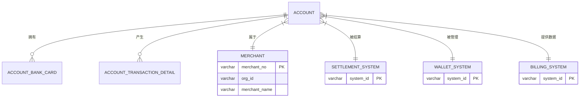
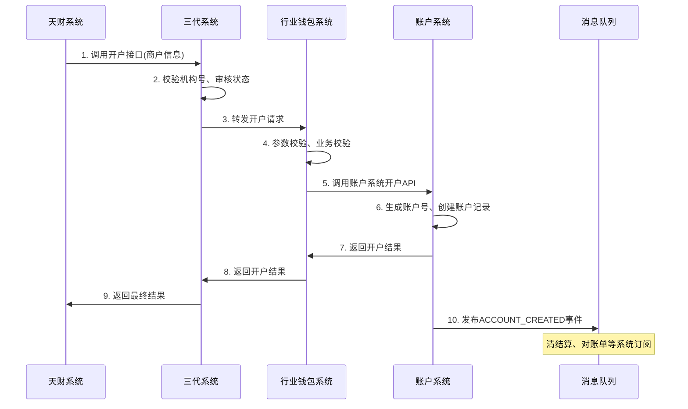
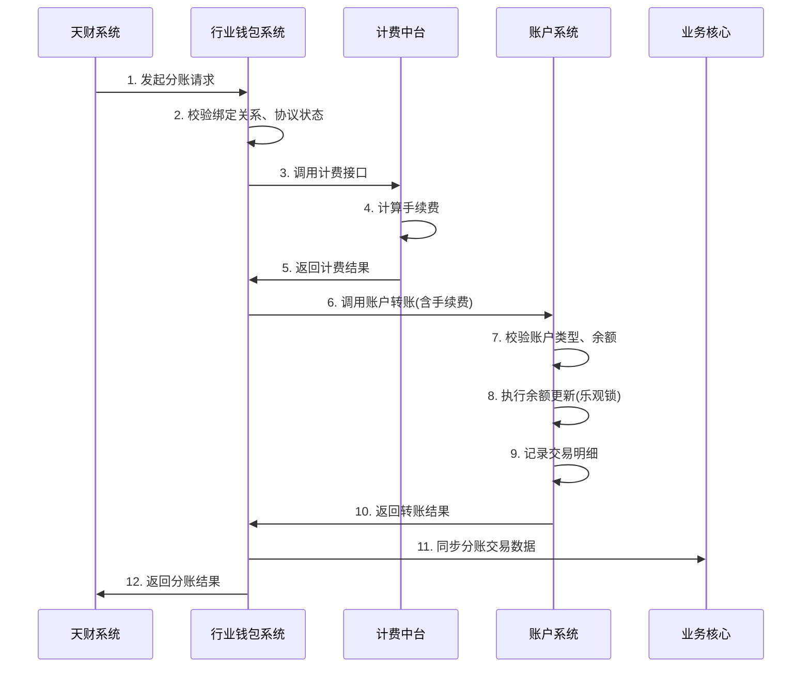

# 模块设计: 账户系统

生成时间: 2026-01-16 17:12:40

---

# 账户系统模块设计文档

## 1. 概述

### 1.1 目的
账户系统作为底层核心账户管理模块，负责为“天财商龙”业务场景创建和管理专用的账户体系。主要目的是：
1. 为天财机构下的商户开立和管理具有特殊标记的“天财专用账户”（包括收款账户和接收方账户）。
2. 控制天财专用账户的特殊能力（如仅限天财账户间转账）。
3. 支持普通收款账户升级为天财专用账户。
4. 为上层系统（三代、行业钱包系统）提供账户基础服务，并确保账户数据的一致性。

### 1.2 范围
- **账户创建**：支持开立天财收款账户、天财接收方账户。
- **账户升级**：支持将普通收款账户升级为天财收款账户。
- **账户标记**：为天财机构下的所有相关账户打上“天财”标记。
- **账户能力控制**：限制天财专用账户仅能与同类型账户进行资金划转。
- **数据提供**：为对账单系统提供账户动账明细数据。
- **冻结支持**：配合清结算系统完成账户冻结操作。

## 2. 接口设计

### 2.1 API端点 (REST)

#### 2.1.1 创建天财专用账户
- **端点**：`POST /api/v1/accounts/tiancai-special`
- **描述**：为指定商户开立天财专用账户（收款账户或接收方账户）。
- **调用方**：行业钱包系统（经三代转发）
- **认证**：机构级API Key (AppId + Secret)，仅限天财机构号调用。
- **请求头**：
  ```json
  {
    "X-App-Id": "tiancai_org_id",
    "X-Api-Key": "encrypted_secret",
    "X-Request-Id": "uuid"
  }
  ```
- **请求体**：
  ```json
  {
    "requestId": "unique_request_id_from_wallet",
    "merchantNo": "收单商户号",
    "accountType": "RECEIVE_ACCOUNT | RECEIVER_ACCOUNT", // 收款账户 | 接收方账户
    "roleType": "HEADQUARTERS | STORE", // 总部 | 门店，仅收款账户必填
    "accountName": "账户名称",
    "certType": "ID_CARD | BUSINESS_LICENSE",
    "certNo": "证件号码",
    "bankCardNo": "默认银行卡号（接收方账户可多卡，此为默认）",
    "bankCode": "银行编码",
    "bankName": "银行名称",
    "upgradeFlag": false, // 是否为升级操作（true时，merchantNo必须已有普通收款账户）
    "effectiveTime": "2024-01-01 00:00:00" // 账户生效时间，用于次日生效场景
  }
  ```
- **响应体** (成功)：
  ```json
  {
    "code": "SUCCESS",
    "message": "开户成功",
    "data": {
      "accountNo": "天财专用账户号",
      "accountType": "RECEIVE_ACCOUNT | RECEIVER_ACCOUNT",
      "accountStatus": "NORMAL",
      "tiancaiFlag": true,
      "merchantNo": "收单商户号",
      "createTime": "2024-01-01 10:00:00"
    }
  }
  ```
- **响应体** (失败)：
  ```json
  {
    "code": "ERROR_CODE",
    "message": "错误描述",
    "data": null
  }
  ```

#### 2.1.2 查询账户信息
- **端点**：`GET /api/v1/accounts/{accountNo}`
- **描述**：查询账户详细信息，包括天财标记、账户类型、状态等。
- **调用方**：行业钱包系统、清结算系统、对账单系统
- **响应体**：
  ```json
  {
    "code": "SUCCESS",
    "data": {
      "accountNo": "账户号",
      "accountType": "RECEIVE_ACCOUNT | RECEIVER_ACCOUNT | SETTLEMENT_ACCOUNT | REFUND_ACCOUNT",
      "accountSubType": "TIANCAI | NORMAL", // 天财专用 | 普通
      "tiancaiFlag": true,
      "merchantNo": "商户号",
      "accountStatus": "NORMAL | FROZEN | CLOSED",
      "balance": "1000.00",
      "currency": "CNY",
      "roleType": "HEADQUARTERS | STORE | NULL",
      "createTime": "2024-01-01 10:00:00",
      "updateTime": "2024-01-01 10:00:00"
    }
  }
  ```

#### 2.1.3 批量查询账户动账明细
- **端点**：`POST /api/v1/accounts/transaction-details`
- **描述**：为对账单系统提供指定时间范围内指定类型账户的动账明细。
- **调用方**：对账单系统
- **请求体**：
  ```json
  {
    "accountTypes": ["RECEIVE_ACCOUNT", "RECEIVER_ACCOUNT", "SETTLEMENT_ACCOUNT", "REFUND_ACCOUNT"],
    "tiancaiFlag": true, // 可选，true只查天财账户
    "startTime": "2024-01-01 00:00:00",
    "endTime": "2024-01-02 00:00:00",
    "pageNo": 1,
    "pageSize": 1000
  }
  ```
- **响应体**：
  ```json
  {
    "code": "SUCCESS",
    "data": {
      "total": 1500,
      "pageNo": 1,
      "pageSize": 1000,
      "details": [
        {
          "accountNo": "账户号",
          "accountType": "RECEIVE_ACCOUNT",
          "tiancaiFlag": true,
          "merchantNo": "商户号",
          "transactionTime": "2024-01-01 10:30:25",
          "transactionType": "IN | OUT",
          "amount": "100.00",
          "balance": "1100.00",
          "oppositeAccountNo": "对方账户号",
          "oppositeAccountName": "对方账户名",
          "transactionId": "原交易流水号",
          "remark": "交易备注"
        }
      ]
    }
  }
  ```

### 2.2 发布的事件

#### 2.2.1 账户创建事件
- **事件名**：`ACCOUNT_CREATED`
- **发布时机**：天财专用账户创建成功时
- **事件内容**：
  ```json
  {
    "eventId": "uuid",
    "eventType": "ACCOUNT_CREATED",
    "timestamp": "2024-01-01T10:00:00Z",
    "data": {
      "accountNo": "天财专用账户号",
      "accountType": "RECEIVE_ACCOUNT | RECEIVER_ACCOUNT",
      "tiancaiFlag": true,
      "merchantNo": "收单商户号",
      "roleType": "HEADQUARTERS | STORE",
      "createTime": "2024-01-01 10:00:00"
    }
  }
  ```

#### 2.2.2 账户状态变更事件
- **事件名**：`ACCOUNT_STATUS_CHANGED`
- **发布时机**：账户状态变更时（冻结、解冻、注销）
- **事件内容**：
  ```json
  {
    "eventId": "uuid",
    "eventType": "ACCOUNT_STATUS_CHANGED",
    "timestamp": "2024-01-01T11:00:00Z",
    "data": {
      "accountNo": "账户号",
      "oldStatus": "NORMAL",
      "newStatus": "FROZEN",
      "reason": "风控冻结",
      "operator": "system",
      "changeTime": "2024-01-01 11:00:00"
    }
  }
  ```

## 3. 数据模型

### 3.1 数据库表设计

#### 表：account (账户主表)
| 字段名 | 类型 | 必填 | 默认值 | 说明 |
|--------|------|------|--------|------|
| id | bigint | Y | AUTO_INCREMENT | 主键 |
| account_no | varchar(32) | Y | | 账户号，唯一 |
| account_type | varchar(20) | Y | | 账户类型：RECEIVE_ACCOUNT(收款账户), RECEIVER_ACCOUNT(接收方账户), SETTLEMENT_ACCOUNT(待结算账户), REFUND_ACCOUNT(退货账户) |
| account_sub_type | varchar(20) | Y | NORMAL | 账户子类型：TIANCAI(天财专用), NORMAL(普通) |
| tiancai_flag | tinyint(1) | Y | 0 | 天财标记：0-否，1-是 |
| merchant_no | varchar(32) | Y | | 所属商户号 |
| account_name | varchar(100) | Y | | 账户名称 |
| account_status | varchar(20) | Y | NORMAL | 账户状态：NORMAL(正常), FROZEN(冻结), CLOSED(注销) |
| role_type | varchar(20) | N | | 角色类型：HEADQUARTERS(总部), STORE(门店) |
| balance | decimal(15,2) | Y | 0.00 | 账户余额 |
| currency | varchar(3) | Y | CNY | 币种 |
| version | int | Y | 0 | 版本号，用于乐观锁 |
| create_time | datetime | Y | CURRENT_TIMESTAMP | 创建时间 |
| update_time | datetime | Y | CURRENT_TIMESTAMP ON UPDATE | 更新时间 |

**索引**：
- 唯一索引：`uk_account_no` (account_no)
- 普通索引：`idx_merchant_no` (merchant_no)
- 复合索引：`idx_tiancai_merchant` (tiancai_flag, merchant_no)
- 复合索引：`idx_type_status` (account_type, account_status)

#### 表：account_bank_card (账户银行卡表，仅接收方账户使用)
| 字段名 | 类型 | 必填 | 默认值 | 说明 |
|--------|------|------|--------|------|
| id | bigint | Y | AUTO_INCREMENT | 主键 |
| account_no | varchar(32) | Y | | 账户号 |
| bank_card_no | varchar(30) | Y | | 银行卡号 |
| bank_code | varchar(10) | Y | | 银行编码 |
| bank_name | varchar(50) | Y | | 银行名称 |
| is_default | tinyint(1) | Y | 0 | 是否默认卡：0-否，1-是 |
| card_status | varchar(20) | Y | NORMAL | 状态：NORMAL(正常), FROZEN(冻结) |
| bind_time | datetime | Y | CURRENT_TIMESTAMP | 绑定时间 |

**索引**：
- 唯一索引：`uk_account_card` (account_no, bank_card_no)
- 普通索引：`idx_account_default` (account_no, is_default)

#### 表：account_transaction_detail (账户交易明细表)
| 字段名 | 类型 | 必填 | 默认值 | 说明 |
|--------|------|------|--------|------|
| id | bigint | Y | AUTO_INCREMENT | 主键 |
| detail_no | varchar(32) | Y | | 明细流水号，唯一 |
| account_no | varchar(32) | Y | | 账户号 |
| account_type | varchar(20) | Y | | 账户类型 |
| tiancai_flag | tinyint(1) | Y | 0 | 天财标记 |
| merchant_no | varchar(32) | Y | | 商户号 |
| transaction_time | datetime | Y | | 交易时间 |
| transaction_type | varchar(10) | Y | | 交易类型：IN(入账), OUT(出账) |
| amount | decimal(15,2) | Y | | 交易金额 |
| balance | decimal(15,2) | Y | | 交易后余额 |
| opposite_account_no | varchar(32) | N | | 对方账户号 |
| opposite_account_name | varchar(100) | N | | 对方账户名 |
| transaction_id | varchar(32) | N | | 原交易流水号 |
| remark | varchar(200) | N | | 备注 |
| create_time | datetime | Y | CURRENT_TIMESTAMP | 创建时间 |

**索引**：
- 唯一索引：`uk_detail_no` (detail_no)
- 复合索引：`idx_account_time` (account_no, transaction_time)
- 复合索引：`idx_merchant_time` (merchant_no, transaction_time)
- 复合索引：`idx_tiancai_time` (tiancai_flag, transaction_time)

### 3.2 与其他模块的关系


## 4. 业务逻辑

### 4.1 核心算法

#### 4.1.1 账户号生成算法
```python
def generate_account_no(account_type, merchant_no, sequence):
    """
    生成账户号算法
    格式：TT + 账户类型码(2位) + 商户号后6位 + 序列号(6位) + 校验码(2位)
    示例：TTRA12345600000123
    """
    # 账户类型映射
    type_map = {
        'RECEIVE_ACCOUNT': 'RA',
        'RECEIVER_ACCOUNT': 'RC',
        'SETTLEMENT_ACCOUNT': 'SA',
        'REFUND_ACCOUNT': 'RF'
    }
    
    prefix = "TT"  # 天财前缀
    type_code = type_map.get(account_type, 'XX')
    merchant_suffix = merchant_no[-6:] if len(merchant_no) >= 6 else merchant_no.zfill(6)
    seq_str = str(sequence).zfill(6)
    
    # 计算校验码（简单示例）
    raw = prefix + type_code + merchant_suffix + seq_str
    check_digit = calculate_check_digit(raw)
    
    return raw + check_digit
```

#### 4.1.2 余额更新乐观锁控制
```java
public boolean updateBalance(String accountNo, BigDecimal amount, String transactionId) {
    int retryCount = 0;
    while (retryCount < MAX_RETRY) {
        Account account = accountDao.selectByAccountNo(accountNo);
        BigDecimal newBalance = account.getBalance().add(amount);
        
        if (newBalance.compareTo(BigDecimal.ZERO) < 0) {
            throw new InsufficientBalanceException("余额不足");
        }
        
        int rows = accountDao.updateBalanceWithVersion(
            accountNo, 
            newBalance, 
            account.getVersion()
        );
        
        if (rows > 0) {
            // 记录交易明细
            saveTransactionDetail(account, amount, transactionId);
            return true;
        }
        
        retryCount++;
        Thread.sleep(RETRY_DELAY);
    }
    throw new ConcurrentUpdateException("账户更新冲突");
}
```

### 4.2 业务规则

#### 4.2.1 账户创建规则
1. **天财机构校验**：仅允许天财机构号（通过AppId识别）调用开户接口。
2. **账户类型限制**：
   - 天财收款账户：必须指定角色类型（总部/门店）
   - 天财接收方账户：可绑定多张银行卡，需指定默认卡
3. **升级规则**：
   - 普通收款账户升级为天财收款账户时，需确保原账户状态正常
   - 升级操作需保持原账户号不变，仅更新账户子类型和标记
4. **唯一性规则**：
   - 一个商户只能有一个天财收款账户
   - 一个商户可以有多个天财接收方账户

#### 4.2.2 转账校验规则
1. **账户类型校验**：天财专用账户只能转账给其他天财专用账户
2. **状态校验**：转出账户和转入账户必须状态正常（非冻结、非注销）
3. **余额校验**：转出账户余额必须充足（考虑手续费）

#### 4.2.3 冻结规则
1. **商户冻结**：冻结该商户对应的所有天财收款账户
2. **交易冻结**：冻结指定交易相关的天财收款账户资金

### 4.3 验证逻辑

#### 4.3.1 开户请求验证
```java
public void validateCreateRequest(TiancaiAccountCreateRequest request) {
    // 1. 基础参数非空校验
    Validate.notNull(request.getMerchantNo(), "商户号不能为空");
    Validate.notNull(request.getAccountType(), "账户类型不能为空");
    
    // 2. 天财机构校验（通过拦截器实现）
    
    // 3. 账户类型特定校验
    if (AccountType.RECEIVE_ACCOUNT.equals(request.getAccountType())) {
        Validate.notNull(request.getRoleType(), "收款账户必须指定角色类型");
    }
    
    if (AccountType.RECEIVER_ACCOUNT.equals(request.getAccountType())) {
        Validate.notNull(request.getBankCardNo(), "接收方账户必须指定银行卡");
    }
    
    // 4. 升级操作校验
    if (request.isUpgradeFlag()) {
        Account existing = accountDao.selectByMerchantNoAndType(
            request.getMerchantNo(), 
            AccountType.RECEIVE_ACCOUNT
        );
        Validate.notNull(existing, "升级操作需要已存在普通收款账户");
        Validate.isTrue(!existing.isTiancaiFlag(), "账户已是天财账户，无需升级");
    }
    
    // 5. 商户是否已有天财收款账户校验
    if (AccountType.RECEIVE_ACCOUNT.equals(request.getAccountType())) {
        long count = accountDao.countTiancaiReceiveAccount(request.getMerchantNo());
        Validate.isTrue(count == 0, "商户已存在天财收款账户");
    }
}
```

## 5. 时序图

### 5.1 天财专用账户开户时序图



### 5.2 天财分账转账时序图



## 6. 错误处理

### 6.1 预期错误码

| 错误码 | HTTP状态码 | 描述 | 处理建议 |
|--------|------------|------|----------|
| ACCOUNT_400001 | 400 | 参数校验失败 | 检查请求参数格式和必填项 |
| ACCOUNT_400002 | 400 | 商户号不存在 | 确认商户号是否正确 |
| ACCOUNT_400003 | 400 | 账户类型不支持 | 检查accountType枚举值 |
| ACCOUNT_403001 | 403 | 非天财机构禁止操作 | 检查AppId和机构权限 |
| ACCOUNT_409001 | 409 | 账户已存在 | 检查是否重复开户 |
| ACCOUNT_409002 | 409 | 并发更新冲突 | 重试操作 |
| ACCOUNT_422001 | 422 | 账户状态异常 | 检查账户是否冻结/注销 |
| ACCOUNT_422002 | 422 | 余额不足 | 检查账户余额 |
| ACCOUNT_422003 | 422 | 转账账户类型限制 | 天财账户只能转天财账户 |
| ACCOUNT_500001 | 500 | 系统内部错误 | 联系技术支持 |

### 6.2 重试策略
1. **乐观锁冲突**：最多重试3次，每次间隔100ms
2. **外部依赖超时**：配置超时时间（HTTP: 3s, DB: 1s），失败后快速失败
3. **MQ消息发送失败**：本地持久化后异步重试，最多5次

### 6.3 监控与告警
1. **关键指标监控**：
   - 开户成功率 < 99.9%
   - 转账失败率 > 0.1%
   - 账户余额异常（负数）
   - 数据库连接池使用率 > 80%
2. **告警渠道**：企业微信、短信、邮件
3. **日志级别**：
   - ERROR：系统异常、数据不一致
   - WARN：业务异常、重试操作
   - INFO：关键业务操作
   - DEBUG：调试信息（生产环境关闭）

## 7. 依赖说明

### 7.1 上游依赖

#### 7.1.1 行业钱包系统
- **依赖关系**：账户系统的主要调用方
- **交互方式**：同步HTTP API调用
- **关键接口**：
  - 开户接口 (`POST /api/v1/accounts/tiancai-special`)
  - 查询接口 (`GET /api/v1/accounts/{accountNo}`)
- **数据流**：接收开户请求，返回账户基础信息
- **SLA要求**：P99响应时间 < 200ms，可用性 > 99.95%

#### 7.1.2 对账单系统
- **依赖关系**：数据消费方
- **交互方式**：
  1. 同步：批量查询动账明细接口
  2. 异步：订阅账户创建事件
- **数据要求**：每日定时拉取D-1日动账明细，支持分页查询
- **数据量预估**：单商户日均1000笔，全量日均1000万笔

### 7.2 下游依赖

#### 7.2.1 数据库 (MySQL)
- **版本**：MySQL 5.7+
- **配置**：主从架构，读写分离
- **表规模预估**：
  - account表：初始100万，年增长50万
  - account_transaction_detail表：初始1亿，年增长1亿
- **性能要求**：单表查询 < 50ms，批量插入 > 1000条/秒

#### 7.2.2 消息队列 (Kafka/RocketMQ)
- **用途**：发布账户相关领域事件
- **Topic配置**：
  - `account-events`: 账户生命周期事件
  - `transaction-events`: 交易相关事件
- **消息格式**：JSON Schema
- **可靠性**：至少一次投递，支持消息重放

#### 7.2.3 配置中心
- **用途**：动态配置开关、参数
- **关键配置**：
  - 天财机构白名单
  - 账户号生成规则
  - 重试策略参数
  - 费率配置缓存

### 7.3 容错设计
1. **数据库降级**：主库故障时自动切换只读模式，提供基础查询服务
2. **缓存策略**：热点账户信息缓存（Redis），TTL 5分钟
3. **限流熔断**：
   - 开户接口：100 QPS/实例
   - 查询接口：500 QPS/实例
   - 转账接口：50 QPS/实例
4. **数据一致性**：
   - 最终一致性：通过事件驱动保证
   - 关键操作：本地事务保证强一致性

---
**文档版本**：v1.0  
**最后更新**：2024年1月  
**负责人**：账户系统架构组