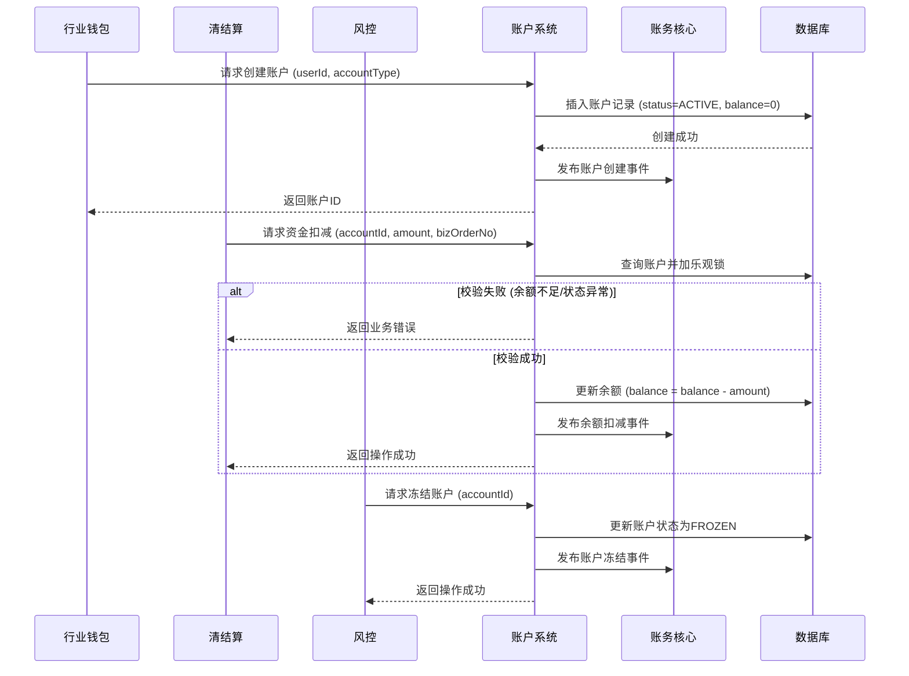

# 模块设计: 账户系统

生成时间: 2026-01-22 17:47:15
批判迭代: 2

---

# 账户系统模块设计文档

## 1. 概述
- **目的与范围**: 账户系统负责底层账户的创建、升级、余额管理、资金扣减/增加、冻结等账户核心操作。其边界是处理与账户实体直接相关的操作，不涉及业务逻辑判断。本模块为行业钱包、清结算、风控等上游模块提供原子化的账户操作能力，并依赖账务核心完成资金变动的最终记录。

## 2. 接口设计
- **API端点 (REST/GraphQL)**: 提供基于RESTful风格的HTTP API。
    - `POST /api/v1/accounts`: 创建账户。
    - `GET /api/v1/accounts/{accountId}`: 查询账户信息。
    - `POST /api/v1/accounts/{accountId}/debit`: 执行资金扣减。
    - `POST /api/v1/accounts/{accountId}/credit`: 执行资金增加。
    - `POST /api/v1/accounts/{accountId}/freeze`: 冻结账户。
    - `POST /api/v1/accounts/{accountId}/unfreeze`: 解冻账户。
- **请求/响应结构**:
    - 创建账户请求：包含 `userId`、`accountType`（如“天财收款账户”、“天财接收方账户”、“01待结算账户”）、`institutionId` 等字段。
    - 资金操作请求：包含 `amount`（金额）、`bizOrderNo`（业务订单号，用于幂等）、`bizType`（业务类型，如“分账”、“结算”、“退货”）等字段。
    - 通用响应：包含 `code`（状态码）、`message`（消息）、`data`（业务数据）等字段。
- **发布/消费的事件**:
    - 消费事件：监听来自清结算的“结算完成指令”、来自风控的“账户冻结指令”、来自行业钱包的“开户指令”。
    - 发布事件：账户创建成功事件、账户余额变动事件（扣减/增加）、账户状态变更事件（冻结/解冻）。这些事件将供账务核心等下游模块消费。

## 3. 数据模型
- **表/集合**: 核心表为 `account`（账户主表）。
- **关键字段**:
    - `account_id`: 账户唯一标识（主键）。
    - `user_id`: 关联的用户ID，来自用户中心。
    - `account_type`: 账户类型，枚举值如 `TIANCAI_COLLECT`（天财收款账户）、`TIANCAI_RECEIVE`（天财接收方账户）、`SETTLEMENT_PENDING`（01待结算账户）、`REFUND`（04退货账户）。
    - `institution_id`: 机构号。
    - `balance`: 账户当前余额。
    - `available_balance`: 可用余额（余额减去冻结金额）。
    - `frozen_amount`: 冻结金额。
    - `status`: 账户状态，如 `ACTIVE`（正常）、`FROZEN`（冻结）、`CLOSED`（注销）。
    - `version`: 数据版本号，用于乐观锁控制并发。
    - `created_at` / `updated_at`: 创建/更新时间。
- **与其他模块的关系**: 账户系统通过 `user_id` 与用户中心关联；通过发布账户变动事件与账务核心关联，确保每笔资金操作都有对应的会计分录。

## 4. 业务逻辑
- **核心工作流/算法**:
    1. **账户创建**: 接收行业钱包的开户指令，校验参数后，创建指定类型的账户，初始化余额为0，并发布账户创建事件。
    2. **资金扣减/增加**: 接收上游（如清结算、行业钱包）的资金操作指令。核心流程：a) 通过 `bizOrderNo` 检查幂等性；b) 使用乐观锁（`version`字段）锁定账户记录；c) 校验账户状态、余额（扣减时需充足）；d) 更新账户余额；e) 发布账户余额变动事件（含变动金额、业务类型）；f) 异步通知账务核心记账。
    3. **账户冻结/解冻**: 接收风控或运营指令，更新账户状态和冻结金额，并发布状态变更事件。
- **业务规则与验证**:
    - 扣减操作必须校验：账户状态为 `ACTIVE`、可用余额 >= 扣减金额。
    - 天财接收方账户仅支持提现（一种特殊的资金扣减），不支持向其他账户转账。
    - 所有资金操作必须携带唯一的 `bizOrderNo` 实现幂等。
- **关键边界情况处理**:
    - **并发控制**: 使用数据库乐观锁（`version`字段）确保余额更新的原子性，防止超扣。
    - **数据一致性**: 采用“本地事务更新账户 + 可靠事件通知”的最终一致性方案。先在本数据库事务内完成账户余额更新，再异步发布事件。账务核心消费事件失败时会重试，确保记账最终完成。
    - **异常状态**: 账户不存在、已注销、已冻结时，直接拒绝操作并返回明确错误。

## 5. 时序图

## 6. 错误处理
- **预期错误情况与错误码**:
    - `ACCOUNT_NOT_FOUND` (40001): 账户不存在。
    - `ACCOUNT_FROZEN` (40002): 账户已冻结。
    - `ACCOUNT_CLOSED` (40003): 账户已注销。
    - `INSUFFICIENT_BALANCE` (40004): 账户余额不足。
    - `DUPLICATED_REQUEST` (40005): 重复请求（`bizOrderNo`已处理）。
    - `CONCURRENT_CONFLICT` (40006): 并发操作冲突（乐观锁失败）。
    - `SYSTEM_ERROR` (50000): 系统内部错误。
- **处理策略**:
    - **业务错误**（4xxxx）：直接向上游返回对应错误码和描述，不进行重试。
    - **并发冲突**：返回明确错误码，建议上游使用原`bizOrderNo`重试。
    - **系统错误**：进行详细日志记录和告警，向上游返回通用系统错误。对于与下游（如账务核心）的事件通信失败，采用异步重试机制，确保事件最终送达。

## 7. 依赖关系
- **上游模块**:
    - **行业钱包**: 调用账户系统创建账户（天财收款账户、天财接收方账户）。
    - **清结算**: 调用账户系统进行资金扣减（如结算划拨、退货扣款）和增加。
    - **风控**: 调用账户系统执行账户冻结/解冻操作。
- **下游模块**:
    - **账务核心**: 消费账户系统发布的所有账户变动事件，进行会计分录记录，是数据一致性的关键下游。