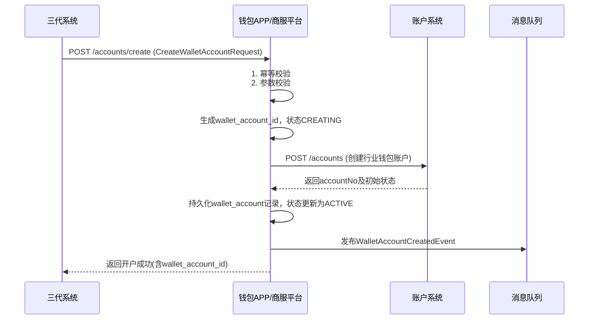
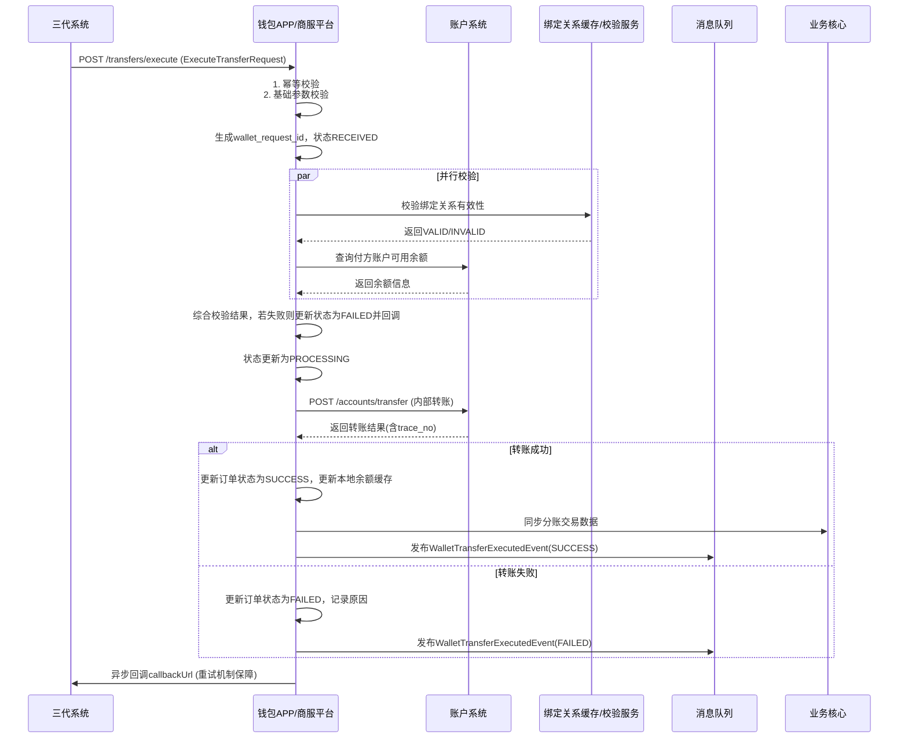
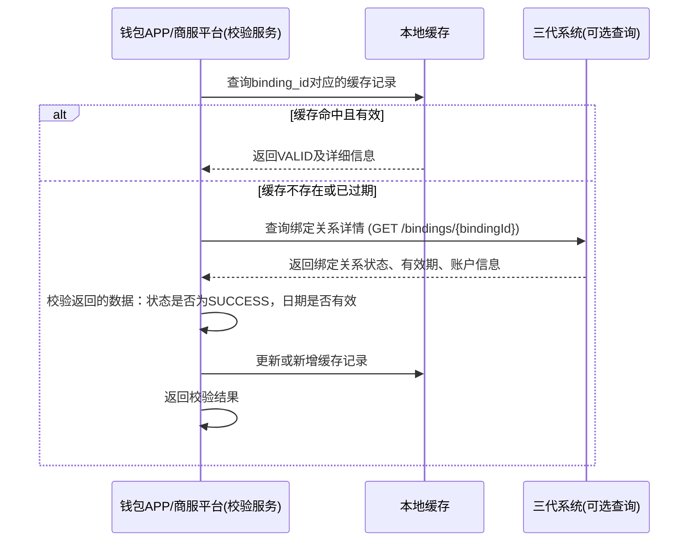

# 模块设计: 钱包APP/商服平台

生成时间: 2026-01-19 14:51:11

---

# 钱包APP/商服平台模块设计文档

## 1. 概述

### 1.1 目的
本模块是“天财商龙”分账业务的**钱包层业务处理与执行中心**。它作为三代系统与底层账户系统之间的核心桥梁，负责处理天财专用账户的开户流转、关系绑定校验、分账指令的执行与资金划转等核心钱包业务逻辑。本模块向上为三代系统提供标准化的钱包服务接口，向下调用账户系统执行实际的资金操作，并确保业务合规性与数据一致性。

### 1.2 范围
- **账户管理**：接收三代系统的开户请求，编排底层账户创建流程，生成钱包层账户标识，并维护钱包账户与底层账户的映射关系。
- **关系绑定校验**：在分账执行前，对三代系统传入的绑定关系（`binding_id`）进行有效性校验，确保付方与收方已建立合规的授权关系。
- **分账指令处理**：接收三代系统的分账请求，执行钱包层业务逻辑（如余额校验、风控检查），调用账户系统完成资金划转，并异步回调通知结果。
- **数据同步**：将分账交易数据同步至业务核心，确保交易流水完整。
- **状态管理**：维护钱包账户的业务状态，并与底层账户状态保持同步。
- **查询服务**：为三代系统提供账户余额、交易状态等查询能力。

### 1.3 非范围
- 商户进件、业务配置与流程编排（由三代系统处理）。
- 电子协议签署与身份认证（由电子签约平台处理）。
- 底层账户的物理创建、记账与状态管理（由账户系统处理）。
- 交易清算、结算与计费（由清结算系统、计费中台处理）。
- 对账单的生成与提供（由对账单系统处理）。

## 2. 接口设计

### 2.1 REST API 端点（供三代系统调用）

#### 2.1.1 账户管理
- **POST /api/v1/wallet/accounts/create**：创建天财专用钱包账户
    - **请求体**：`CreateWalletAccountRequest`
    - **响应**：`CreateWalletAccountResponse`
- **GET /api/v1/wallet/accounts/{walletAccountId}**：查询钱包账户详情
    - **响应**：`WalletAccountDetailResponse`
- **GET /api/v1/wallet/accounts/by-merchant/{merchantNo}**：查询商户下所有钱包账户
    - **响应**：`List<WalletAccountSimpleResponse>`

#### 2.1.2 分账业务执行
- **POST /api/v1/wallet/transfers/execute**：执行分账（转账）
    - **请求体**：`ExecuteTransferRequest`
    - **响应**：`ExecuteTransferResponse` (包含异步任务ID)
- **GET /api/v1/wallet/transfers/{requestId}**：查询分账执行状态
    - **响应**：`TransferDetailResponse`
- **POST /api/v1/wallet/transfers/batch-validate**：批量校验分账可行性（预检查）
    - **请求体**：`BatchValidateRequest`
    - **响应**：`BatchValidateResponse`

#### 2.1.3 绑定关系校验
- **POST /api/v1/wallet/bindings/validate**：校验绑定关系有效性
    - **请求体**：`ValidateBindingRequest`
    - **响应**：`ValidateBindingResponse`

### 2.2 内部接口（供其他系统调用/回调）

- **POST /internal/api/v1/wallet/callback/account-status**：账户系统回调账户状态变更
    - **请求体**：`AccountStatusCallbackRequest`
    - **响应**：`BaseResponse`
- **POST /internal/api/v1/wallet/sync/split-record**：业务核心拉取分账交易数据（可选，或通过消息同步）
    - **请求体**：`SyncSplitRecordRequest`
    - **响应**：`SyncSplitRecordResponse`

### 2.3 数据结构

```json
// CreateWalletAccountRequest
{
  "requestId": "WALLET_ACC_CREATE_001",
  "merchantNo": "M100001",
  "merchantName": "示例商户",
  "accountType": "TIANCAI_COLLECT", // TIANCAI_COLLECT, TIANCAI_RECEIVE
  "settlementMode": "ACTIVE",
  "contactPhone": "13800138000",
  "certInfo": {
    "certType": "UNIFIED_SOCIAL_CREDIT_CODE",
    "certNo": "91310101MA1FL2345X"
  }
}

// ExecuteTransferRequest
{
  "requestId": "WALLET_TRANSFER_001",
  "bizType": "COLLECTION",
  "payerWalletAccountId": "WALLET_ACC_STORE_001",
  "receiverWalletAccountId": "WALLET_ACC_HQ_001",
  "amount": "10000.00",
  "currency": "CNY",
  "bindingId": "BIND_001",
  "bindingBizType": "COLLECTION",
  "merchantInfo": {
    "payerMerchantNo": "M100001",
    "receiverMerchantNo": "M100000"
  },
  "memo": "营业款归集",
  "callbackUrl": "https://third-gen.example.com/callback/split-result"
}

// ExecuteTransferResponse
{
  "code": "SUCCESS",
  "message": "请求已接收",
  "data": {
    "walletRequestId": "WALLET_REQ_20231027001",
    "status": "PROCESSING",
    "estimatedFinishTime": "2023-10-27T15:00:00Z"
  }
}

// ValidateBindingRequest
{
  "bindingId": "BIND_001",
  "bizType": "COLLECTION",
  "payerWalletAccountId": "WALLET_ACC_STORE_001",
  "receiverWalletAccountId": "WALLET_ACC_HQ_001",
  "validateDate": "2023-10-27" // 校验生效日期，默认当天
}

// AccountStatusCallbackRequest
{
  "eventId": "ACC_EVT_001",
  "accountNo": "ACC202310270001",
  "walletAccountId": "WALLET_ACC_001",
  "oldStatus": "ACTIVE",
  "newStatus": "FROZEN",
  "changeReason": "风险控制",
  "changeTime": "2023-10-27T14:30:00Z"
}
```

### 2.4 发布的事件
钱包系统作为事件生产者，发布以下事件：

- **WalletAccountCreatedEvent**：钱包账户创建成功。
    ```json
    {
      "eventId": "EVT_WALLET_ACC_CREATED_001",
      "eventType": "WALLET_ACCOUNT_CREATED",
      "timestamp": "2023-10-27T10:10:00Z",
      "data": {
        "walletAccountId": "WALLET_ACC_001",
        "accountNo": "ACC202310270001",
        "merchantNo": "M100001",
        "accountType": "TIANCAI_COLLECT",
        "status": "ACTIVE"
      }
    }
    ```
- **WalletTransferExecutedEvent**：分账执行完成（成功/失败）。
- **BindingValidationFailedEvent**：绑定关系校验失败（用于监控与告警）。

### 2.5 消费的事件
钱包系统作为事件消费者，订阅以下事件：

- **TiancaiAccountConfiguredEvent** (来自三代系统)：触发钱包账户创建流程。
- **BindingRelationshipEstablishedEvent** (来自三代系统)：缓存生效的绑定关系，加速校验。
- **AccountStatusChangedEvent** (来自账户系统)：同步底层账户状态至钱包账户。

## 3. 数据模型

### 3.1 核心表设计

#### 表：`wallet_account` (钱包账户表)
| 字段名 | 类型 | 必填 | 描述 | 索引 |
|--------|------|------|------|------|
| id | bigint(20) | Y | 自增主键 | PK |
| wallet_account_id | varchar(64) | Y | 钱包账户唯一标识 | UK |
| merchant_no | varchar(32) | Y | 所属商户号 | IDX |
| account_no | varchar(32) | Y | 底层账户号（账户系统） | UK |
| account_type | varchar(32) | Y | 账户类型：TIANCAI_COLLECT, TIANCAI_RECEIVE | IDX |
| account_name | varchar(128) | Y | 账户名称 | |
| status | varchar(16) | Y | 状态：CREATING, ACTIVE, FROZEN, CLOSED | IDX |
| balance | decimal(15,2) | Y | 账户余额（缓存，最终以账户系统为准） | |
| freeze_amount | decimal(15,2) | Y | 冻结金额 | |
| settlement_mode | varchar(16) | N | 结算模式（仅COLLECT账户有） | |
| cert_info | json | Y | 认证信息（证件类型、号码） | |
| create_time | datetime | Y | 创建时间 | IDX |
| update_time | datetime | Y | 更新时间 | |

#### 表：`wallet_transfer_order` (钱包分账指令表)
| 字段名 | 类型 | 必填 | 描述 | 索引 |
|--------|------|------|------|------|
| id | bigint(20) | Y | 自增主键 | PK |
| wallet_request_id | varchar(64) | Y | 钱包系统请求ID | UK |
| third_request_id | varchar(64) | Y | 三代系统请求ID | IDX |
| biz_type | varchar(32) | Y | 业务类型：COLLECTION, BATCH_PAYMENT, MEMBER_SETTLE | IDX |
| payer_wallet_account_id | varchar(64) | Y | 付方钱包账户ID | IDX |
| receiver_wallet_account_id | varchar(64) | Y | 收方钱包账户ID | IDX |
| amount | decimal(15,2) | Y | 分账金额 | |
| currency | char(3) | Y | 币种 | |
| binding_id | varchar(32) | Y | 绑定关系ID | IDX |
| status | varchar(16) | Y | 状态：RECEIVED, VALIDATING, PROCESSING, SUCCESS, FAILED | IDX |
| account_system_trace_no | varchar(64) | N | 账户系统流水号 | |
| fail_reason | varchar(256) | N | 失败原因 | |
| memo | varchar(256) | N | 备注 | |
| callback_url | varchar(512) | Y | 三代系统回调地址 | |
| callback_status | varchar(16) | Y | 回调状态：PENDING, SUCCESS, FAILED | IDX |
| callback_retry_count | int(3) | Y | 回调重试次数 | |
| create_time | datetime | Y | 创建时间 | IDX |
| update_time | datetime | Y | 更新时间 | |

#### 表：`binding_validation_cache` (绑定关系校验缓存表)
| 字段名 | 类型 | 必填 | 描述 | 索引 |
|--------|------|------|------|------|
| id | bigint(20) | Y | 自增主键 | PK |
| binding_id | varchar(32) | Y | 绑定关系ID | UK |
| biz_type | varchar(32) | Y | 业务类型 | IDX |
| payer_wallet_account_id | varchar(64) | Y | 付方钱包账户ID | IDX |
| receiver_wallet_account_id | varchar(64) | Y | 收方钱包账户ID | IDX |
| validation_result | varchar(16) | Y | 校验结果：VALID, INVALID | |
| invalid_reason | varchar(128) | N | 无效原因 | |
| effective_date | date | Y | 生效日期 | |
| expiry_date | date | Y | 失效日期 | |
| last_validated_time | datetime | Y | 最后校验时间 | |
| create_time | datetime | Y | 创建时间 | IDX |

#### 表：`wallet_account_balance_log` (钱包账户余额变更日志表)
| 字段名 | 类型 | 必填 | 描述 | 索引 |
|--------|------|------|------|------|
| id | bigint(20) | Y | 自增主键 | PK |
| wallet_account_id | varchar(64) | Y | 钱包账户ID | IDX |
| change_type | varchar(32) | Y | 变更类型：TRANSFER_OUT, TRANSFER_IN, ADJUST, SYNC | |
| related_request_id | varchar(64) | N | 关联请求ID | IDX |
| before_balance | decimal(15,2) | Y | 变更前余额 | |
| change_amount | decimal(15,2) | Y | 变更金额（正负） | |
| after_balance | decimal(15,2) | Y | 变更后余额 | |
| remark | varchar(256) | N | 备注 | |
| create_time | datetime | Y | 创建时间 | IDX |

### 3.2 与其他模块的关系
- **三代系统**：**主要服务调用方**。接收其开户、分账、校验等请求，并异步回调结果。是本模块业务数据的主要来源。
- **账户系统**：**核心下游依赖**。通过同步RPC调用，执行实际的账户创建、状态变更、资金划转等底层操作。是本模块指令的最终执行者。
- **业务核心**：**数据同步下游**。将成功的分账交易数据同步至业务核心，确保交易流水完整。
- **清结算系统**：**配置信息同步来源**。接收清结算同步的费率等信息，用于风控或校验（如手续费预估）。
- **对账单系统**：**无直接交互**。分账数据通过业务核心间接提供。
- **电子签约平台**：**无直接交互**。绑定关系信息通过三代系统传递。

## 4. 业务逻辑

### 4.1 核心算法
- **钱包账户ID生成**：`WALLET_ACC` + `商户号后6位` + `账户类型简写` + `6位随机数` (如 `WALLET_ACC_0001TC_AB12CD`)。
- **钱包请求ID生成**：`WALLET_REQ` + `年月日` + `8位序列号`。
- **余额缓存更新**：
    - 分账成功时，本地更新付方和收方的`balance`字段（`balance = balance ± amount`）。
    - 定时任务定期与账户系统核对余额，修正差异。
- **绑定关系缓存刷新策略**：
    - 收到`BindingRelationshipEstablishedEvent`时，新增或更新缓存。
    - 校验时，若缓存不存在或已过期，则向三代系统发起查询（或访问其提供的只读接口）获取最新绑定关系并更新缓存。
    - 每日凌晨清理过期缓存。

### 4.2 业务规则
1. **账户开立规则**：
    - 根据`accountType`，调用账户系统开立对应的“行业钱包（非小微钱包）”账户。
    - 必须记录账户系统返回的`accountNo`，建立`wallet_account_id`与`accountNo`的映射。
    - 开立成功后，发布`WalletAccountCreatedEvent`。

2. **分账执行规则**：
    - **前置校验**（同步进行）：
        a. 校验付方、收方钱包账户状态均为`ACTIVE`。
        b. 调用`绑定关系校验`流程，确保`binding_id`有效。
        c. （可选）风控检查：单笔/日累计限额、交易频次等。
    - **余额检查**：调用账户系统接口查询付方账户可用余额，确保大于等于分账金额。
    - **执行转账**：调用账户系统内部转账接口，指定付方`accountNo`、收方`accountNo`、金额。
    - **结果处理**：根据账户系统返回结果，更新订单状态，并异步回调三代系统。

3. **绑定关系校验规则**：
    - 校验绑定关系是否存在于缓存且状态为`VALID`。
    - 校验当前日期是否在绑定关系的`effective_date`与`expiry_date`之间。
    - 校验绑定的付方、收方钱包账户ID与请求中的是否一致。
    - 校验绑定的`bizType`与当前分账业务类型是否匹配。

### 4.3 验证逻辑
- **开户请求验证**：校验商户号、账户类型合法性，防止重复开户（通过`requestId`和`merchantNo`+`accountType`唯一性判断）。
- **分账请求验证**：
    - 金额必须大于0且符合金额精度要求。
    - 付方与收方账户不能相同。
    - `callbackUrl`格式校验。
- **回调请求验证**：
    - 验证签名，确保回调来源可信（账户系统、三代系统回调需配置白名单或签名密钥）。
    - 实现回调幂等，防止重复处理。

## 5. 时序图

### 5.1 创建天财专用钱包账户


### 5.2 执行分账（转账）流程


### 5.3 绑定关系校验流程


## 6. 错误处理

### 6.1 预期错误及HTTP状态码
- **400 Bad Request**：请求参数错误、格式非法。
- **403 Forbidden**：签名验证失败、IP不在白名单。
- **404 Not Found**：钱包账户不存在。
- **409 Conflict**：
    - `DUPLICATE_REQUEST_ID`：重复请求。
    - `DUPLICATE_ACCOUNT`：重复开户。
- **422 Unprocessable Entity**：
    - `BINDING_INVALID`：绑定关系无效或过期。
    - `INSUFFICIENT_BALANCE`：付方余额不足。
    - `ACCOUNT_STATUS_INVALID`：账户非ACTIVE状态。
    - `TRANSFER_LIMIT_EXCEEDED`：超过单笔或日累计限额。
- **502 Bad Gateway**：调用账户系统失败。
- **504 Gateway Timeout**：调用下游系统超时。
- **500 Internal Server Error**：系统内部错误。

### 6.2 处理策略
- **同步调用重试**：对账户系统的调用（查询余额、转账）配置可重试异常（如网络超时），最多重试3次。若重试后仍失败，则将分账订单置为`FAILED`。
- **异步回调重试**：对三代系统的回调，若失败（非2xx响应），进入重试队列。采用指数退避策略重试，最多重试5次，超过后标记为`FAILED`并发出告警，需人工介入。
- **状态一致性保障**：
    - 通过消费`AccountStatusChangedEvent`，及时更新本地钱包账户状态。
    - 定时任务扫描长时间处于`PROCESSING`状态的分账订单，主动查询账户系统交易结果进行冲正或状态同步。
    - 每日对账：将本地`wallet_account`的余额与账户系统进行核对，记录差异并告警。
- **熔断与降级**：对账户系统、三代系统查询接口配置熔断器，防止下游故障导致系统雪崩。降级策略：如绑定关系校验降级为只校验缓存，缓存不存在则返回“需人工确认”。
- **监控与告警**：监控关键接口成功率、下游调用延迟、订单积压数、余额差异率等指标。

## 7. 依赖说明

### 7.1 上游模块交互（调用方）
1. **三代系统**：
    - **调用关系**：**同步RPC调用（主） + 异步HTTP回调**。
    - **关键交互**：接收开户、分账、校验请求；回调分账结果。
    - **交互要点**：
        - 接口需高性能、高可用，支持高并发分账请求。
        - 严格校验请求的合法性，防止非法调用。
        - 回调机制需可靠，确保三代系统能最终感知分账结果。

### 7.2 下游模块交互（被调用/消费事件）
1. **账户系统**：
    - **调用关系**：**同步RPC调用（核心依赖）**。
    - **关键接口**：创建账户、查询账户详情/余额、内部转账、查询交易结果。
    - **交互要点**：
        - 这是资金操作的核心通道，必须保证接口的幂等性和事务性。
        - 需处理所有可能的业务错误码（如余额不足、账户冻结），并转化为业务语义错误返回给上游。
        - 网络超时和系统异常需有明确的处理与补偿机制。

2. **业务核心**：
    - **交互关系**：**同步RPC调用或异步消息**。
    - **关键接口**：同步分账交易记录。
    - **交互要点**：确保每笔成功分账都有对应的交易流水同步，数据格式需符合业务核心要求。

3. **清结算系统**：
    - **交互关系**：**配置同步（消息或接口）**。
    - **关键交互**：获取商户/产品的费率、限额配置。
    - **交互要点**：用于分账前的风控检查，需确保配置信息的及时性。

### 7.3 内部依赖
- **数据库**：MySQL集群，存储业务状态数据，要求强一致性。
- **缓存**：Redis集群，用于存储绑定关系缓存、账户余额快照、请求幂等键，要求高并发低延迟。
- **消息中间件**：Kafka/RocketMQ，用于事件发布与订阅，实现系统解耦。
- **配置中心**：管理下游系统地址、超时时间、重试策略、风控规则等。

---
**文档版本**：1.0  
**最后更新**：2023-10-27  
**设计者**：软件架构师