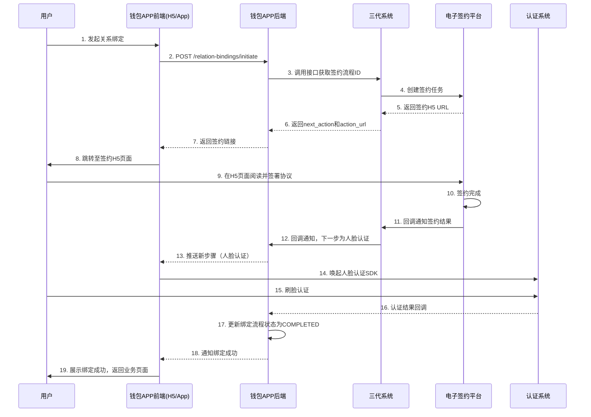

# 模块设计: 钱包APP/商服平台

生成时间: 2026-01-19 15:32:55

---

# 钱包APP/商服平台模块设计文档

## 1. 概述

### 1.1 目的
钱包APP/商服平台模块是面向**天财机构**及其下属**总部**、**门店**等角色用户的**前端业务操作平台**。本模块作为天财分账业务的**用户交互层**，提供直观、便捷的界面，引导用户完成账户开通、关系绑定、分账指令发起、交易查询等全流程操作。它是连接天财业务用户与后端核心系统（三代系统、行业钱包系统）的**关键桥梁**，旨在提升用户体验和业务处理效率。

### 1.2 范围
- **用户门户**：为天财、总部、门店等不同角色提供专属的业务操作界面。
- **账户管理**：展示天财专用账户信息、状态，支持银行卡绑定与管理。
- **关系绑定流程引导**：通过H5页面集成电子签约、人脸/打款认证，引导用户完成分账关系建立的法律流程。
- **分账业务发起**：提供归集、批量付款、会员结算等场景的业务发起界面与表单。
- **交易与账单查询**：提供分账记录、账户流水、对账单的查询与下载功能。
- **消息与通知**：向用户推送业务处理结果、认证提醒等重要通知。

## 2. 接口设计

### 2.1 API端点 (RESTful)

#### 2.1.1 用户与权限接口
- **GET /api/v1/user/current**
    - **描述**：获取当前登录用户的身份信息、所属机构及角色列表。
    - **响应体**：
      ```json
      {
        "code": "SUCCESS",
        "data": {
          "user_id": "user_tc_admin_001",
          "user_name": "天财管理员",
          "institution_code": "TIANCAI",
          "roles": ["TIANCAI_ADMIN"], // 用户角色：TIANCAI_ADMIN, HEADQUARTERS_ADMIN, STORE_OPERATOR
          "managed_merchants": ["M100001", "M100002"], // 可管理的商户列表
          "permissions": ["ACCOUNT_VIEW", "SPLIT_ORDER_CREATE"]
        }
      }
      ```

#### 2.1.2 账户信息接口
- **GET /api/v1/accounts**
    - **描述**：获取当前用户有权查看的天财专用账户列表。
    - **查询参数**：
        - `merchant_no` (可选)：筛选指定商户的账户。
        - `account_role` (可选)：筛选指定角色的账户（HEADQUARTERS/STORE/RECEIVER）。
    - **响应体**：
      ```json
      {
        "code": "SUCCESS",
        "data": {
          "accounts": [
            {
              "tiancai_account_id": "TCA_20231011001",
              "account_no": "3010001001",
              "account_role": "HEADQUARTERS",
              "merchant_no": "M100001",
              "merchant_name": "天财品牌总部",
              "status": "ACTIVE",
              "balance": 5000000, // 余额（分）
              "currency": "CNY",
              "bank_cards": [
                {
                  "card_id": "bc_001",
                  "bank_name": "中国工商银行",
                  "card_no_suffix": "1234",
                  "is_default": true,
                  "status": "BOUND"
                }
              ],
              "created_at": "2023-10-11T10:00:00Z"
            }
          ]
        }
      }
      ```

#### 2.1.3 关系绑定流程接口
- **POST /api/v1/relation-bindings/initiate**
    - **描述**：发起关系绑定流程。根据场景生成签约链接或唤起认证流程。
    - **请求体**：
      ```json
      {
        "scene": "COLLECTION", // COLLECTION, BATCH_PAY, MEMBER_SETTLE, PAYMENT_AUTH
        "payer": {
          "tiancai_account_id": "TCA_20231011001",
          "merchant_no": "M100001"
        },
        "payee": {
          "tiancai_account_id": "TCA_20231011002",
          "merchant_no": "M100002",
          "account_role": "RECEIVER", // 仅BATCH_PAY场景需要
          "bank_card": { // 仅当payee为RECEIVER且需要绑卡时
            "bank_name": "中国建设银行",
            "card_no": "6217000010001234567",
            "account_name": "张三"
          }
        }
      }
      ```
    - **响应体**：
      ```json
      {
        "code": "SUCCESS",
        "data": {
          "process_id": "BIND_PROC_001",
          "next_action": "SIGN_CONTRACT", // SIGN_CONTRACT, FACE_AUTH, REMIT_AUTH, COMPLETE
          "action_url": "https://esign.lakala.com/h5/contract?token=xyz", // H5签约页面URL
          "expires_in": 1800 // 操作有效期（秒）
        }
      }
      ```

#### 2.1.4 分账业务发起接口
- **POST /api/v1/split-orders**
    - **描述**：发起分账指令（归集、批量付款、会员结算）。请求将被转发至三代系统。
    - **请求体**：
      ```json
      {
        "request_id": "front_req_20231011001", // 前端生成，用于幂等
        "biz_scene": "COLLECTION",
        "payer_account_id": "TCA_20231011001",
        "payee_list": [
          {
            "payee_account_id": "TCA_20231011002",
            "amount": 10000,
            "memo": "门店日结归集"
          }
        ],
        "total_amount": 10000,
        "biz_ref_no": "TC_DAILY_001",
        "callback_url": "https://wallet-app.lakala.com/api/callback/tiancai" // 本模块回调地址，用于接收三代回调后通知前端
      }
      ```
    - **响应体**：
      ```json
      {
        "code": "SUCCESS",
        "data": {
          "split_order_id": "SO_202310110001",
          "status": "PROCESSING",
          "estimated_completion_time": 30 // 预计处理时间（秒）
        }
      }
      ```

#### 2.1.5 查询接口
- **GET /api/v1/split-orders**
    - **描述**：分页查询分账订单列表。
- **GET /api/v1/split-orders/{split_order_id}**
    - **描述**：查询分账订单详情。
- **GET /api/v1/transactions**
    - **描述**：查询账户动账流水。
- **GET /api/v1/statements**
    - **描述**：查询并下载对账单（机构层面分账、提款、收单账单）。

#### 2.1.6 回调接口 (供三代系统调用)
- **POST /api/internal/callback/tiancai**
    - **描述**：接收三代系统异步回调，更新前端状态并通过WebSocket等通道通知用户。
    - **请求体**：
      ```json
      {
        "split_order_id": "SO_202310110001",
        "status": "SUCCESS",
        "result_data": {
          "actual_amount": 10000,
          "finish_time": "2023-10-11T10:05:00Z"
        },
        "error_info": null,
        "timestamp": "2023-10-11T10:05:00Z"
      }
      ```

### 2.2 发布/消费的事件

#### 2.2.1 消费的事件
- **SplitOrderStatusChangedEvent** (来自三代系统回调)：消费分账订单状态变更事件，用于更新前端状态和推送用户通知。
- **RelationBindingCompletedEvent** (来自电子签约平台/行业钱包系统回调)：消费关系绑定完成事件，更新绑定状态。

#### 2.2.2 发布的事件 (前端内部事件，用于驱动UI)
- **UserNotificationEvent**：向特定用户推送业务通知。
  ```json
  {
    "event_type": "USER_NOTIFICATION",
    "user_id": "user_tc_admin_001",
    "notification": {
      "title": "分账成功",
      "content": "分账订单 SO_202310110001 处理成功，金额100.00元。",
      "type": "SUCCESS",
      "related_order_id": "SO_202310110001",
      "timestamp": "2023-10-11T10:05:00Z"
    }
  }
  ```

## 3. 数据模型

### 3.1 核心表设计

#### 表：`user` (用户表)
| 字段名 | 类型 | 必填 | 默认值 | 描述 |
| :--- | :--- | :--- | :--- | :--- |
| `id` | bigint | Y | AUTO_INCREMENT | 主键 |
| `user_id` | varchar(64) | Y | | **用户唯一标识**，与IAM系统对齐 |
| `user_name` | varchar(100) | Y | | 用户姓名 |
| `institution_code` | varchar(20) | Y | | 所属机构代码，如`TIANCAI` |
| `role_codes` | json | Y | `[]` | 角色代码列表 |
| `managed_merchant_nos` | json | Y | `[]` | 可管理的收单商户号列表 |
| `status` | varchar(20) | Y | `ACTIVE` | 状态 |
| `created_at` | datetime | Y | CURRENT_TIMESTAMP | |

#### 表：`frontend_split_order` (前端分账订单表)
| 字段名 | 类型 | 必填 | 默认值 | 描述 |
| :--- | :--- | :--- | :--- | :--- |
| `id` | bigint | Y | AUTO_INCREMENT | 主键 |
| `front_order_id` | varchar(32) | Y | | 前端订单号，用于关联前端会话 |
| `split_order_id` | varchar(32) | Y | | 三代系统分账订单号 |
| `request_id` | varchar(64) | Y | | 前端请求流水号，用于幂等 |
| `user_id` | varchar(64) | Y | | 发起用户ID |
| `biz_scene` | varchar(20) | Y | | 业务场景 |
| `payer_account_id` | varchar(32) | Y | | 付方账户ID |
| `total_amount` | decimal(15,2) | Y | | 总金额 |
| `status` | varchar(20) | Y | `INIT` | 状态：`INIT`, `PROCESSING`, `SUCCESS`, `FAILED` |
| `callback_received` | tinyint(1) | Y | 0 | 是否已收到三代回调 |
| `ui_status` | varchar(20) | Y | `PENDING_SUBMIT` | UI状态：`PENDING_SUBMIT`, `SUBMITTED`, `SHOW_RESULT` |
| `form_data` | json | Y | | 前端表单提交的原始数据 |
| `result_data` | json | N | | 三代回调的结果数据 |
| `created_at` | datetime | Y | CURRENT_TIMESTAMP | |
| `updated_at` | datetime | Y | CURRENT_TIMESTAMP ON UPDATE | |

#### 表：`relation_binding_flow` (关系绑定流程表)
| 字段名 | 类型 | 必填 | 默认值 | 描述 |
| :--- | :--- | :--- | :--- | :--- |
| `id` | bigint | Y | AUTO_INCREMENT | 主键 |
| `flow_id` | varchar(32) | Y | | 前端绑定流程ID |
| `process_id` | varchar(32) | Y | | 后端流程ID（三代或钱包系统） |
| `scene` | varchar(20) | Y | | 绑定场景 |
| `payer_info` | json | Y | | 付方信息 |
| `payee_info` | json | Y | | 收方信息 |
| `current_step` | varchar(30) | Y | | 当前步骤：`INIT`, `SIGNING`, `AUTHING`, `COMPLETED` |
| `step_data` | json | N | | 各步骤的临时数据（如签约token） |
| `expire_time` | datetime | N | | 流程过期时间 |
| `user_id` | varchar(64) | Y | | 操作用户 |
| `created_at` | datetime | Y | CURRENT_TIMESTAMP | |

#### 表：`user_notification` (用户通知表)
| 字段名 | 类型 | 必填 | 默认值 | 描述 |
| :--- | :--- | :--- | :--- | :--- |
| `id` | bigint | Y | AUTO_INCREMENT | 主键 |
| `user_id` | varchar(64) | Y | | 目标用户ID |
| `title` | varchar(200) | Y | | 通知标题 |
| `content` | text | Y | | 通知内容 |
| `type` | varchar(20) | Y | | 类型：`SUCCESS`, `WARNING`, `ERROR`, `INFO` |
| `related_id` | varchar(64) | N | | 关联业务ID（如订单号） |
| `read` | tinyint(1) | Y | 0 | 是否已读 |
| `created_at` | datetime | Y | CURRENT_TIMESTAMP | |

### 3.2 与其他模块的关系
- **三代系统**：通过`frontend_split_order.split_order_id`关联分账订单；通过回调接口接收处理结果。
- **行业钱包系统/电子签约平台**：通过`relation_binding_flow.process_id`关联绑定流程；通过H5页面嵌入或重定向进行交互。
- **账户系统**：间接通过三代系统或行业钱包系统获取账户数据，本地不持久化核心账户信息。
- **对账单系统**：通过接口获取账单数据，提供下载链接。

## 4. 业务逻辑

### 4.1 核心算法与规则

#### 4.1.1 用户权限与数据隔离
```python
def get_accessible_accounts(user_id):
    """
    根据用户角色和管理的商户，返回可查看的账户列表。
    规则：
    1. TIANCAI_ADMIN: 可查看所有天财机构下的账户。
    2. HEADQUARTERS_ADMIN: 仅可查看所属总部商户及其关联门店的账户。
    3. STORE_OPERATOR: 仅可查看所属门店的账户。
    """
    user = get_user(user_id)
    if 'TIANCAI_ADMIN' in user.role_codes:
        return query_all_tiancai_accounts()
    elif 'HEADQUARTERS_ADMIN' in user.role_codes:
        # 获取该总部管理的所有门店商户号
        managed_stores = get_managed_stores(user.managed_merchant_nos)
        return query_accounts_by_merchants([user.managed_merchant_nos] + managed_stores)
    else:
        return query_accounts_by_merchants(user.managed_merchant_nos)
```

#### 4.1.2 关系绑定流程引导引擎
```python
def determine_binding_steps(scene, payer_role, payee_role, payee_has_bank_card):
    """
    根据业务场景和账户角色，确定关系绑定所需的步骤序列。
    返回如：['SIGN_CONTRACT', 'FACE_AUTH']。
    """
    steps = []
    
    if scene in ['COLLECTION', 'MEMBER_SETTLE']:
        # 总部与门店间绑定：需签署《分账协议》
        steps.append('SIGN_CONTRACT')
        # 根据账户类型决定认证方式
        if payee_role == 'STORE':  # 门店为对私账户？需确认，此处为示例
            steps.append('FACE_AUTH')
        else:
            steps.append('REMIT_AUTH')
    
    elif scene == 'BATCH_PAY':
        # 总部与接收方绑定：需签署《代付授权协议》
        steps.append('SIGN_CONTRACT')
        if not payee_has_bank_card:
            steps.append('BIND_BANK_CARD')  # 引导绑卡
        steps.append('REMIT_AUTH')  # 接收方通常为对公账户
    
    elif scene == 'PAYMENT_AUTH':
        # 开通付款权限：总部签署《代付授权协议》
        steps.append('SIGN_CONTRACT')
    
    return steps
```

#### 4.1.3 分账请求预处理与幂等
```python
def submit_split_order(user_id, form_data):
    """
    提交分账请求前端处理逻辑。
    1. 生成前端订单号和幂等ID。
    2. 保存表单数据。
    3. 调用三代接口。
    4. 启动轮询或等待回调。
    """
    front_order_id = generate_front_order_id()
    request_id = f"{user_id}_{timestamp}_{random_suffix}"
    
    # 幂等检查：基于(request_id, user_id)防止重复提交
    if duplicate_request_exists(request_id, user_id):
        return get_existing_order(request_id)
    
    # 保存前端订单记录
    save_frontend_order(front_order_id, request_id, user_id, form_data, status='INIT')
    
    # 构建调用三代的请求体
    backend_request = transform_to_backend_request(form_data, request_id)
    
    try:
        # 同步调用三代接口
        response = call_generation3_api('/split-orders', backend_request)
        split_order_id = response['split_order_id']
        
        # 更新关联关系
        update_frontend_order(front_order_id, split_order_id=split_order_id, status='PROCESSING')
        
        # 启动后台任务轮询状态（备用，主要靠回调）
        start_status_polling(front_order_id, split_order_id)
        
        return {'front_order_id': front_order_id, 'status': 'PROCESSING'}
    except Exception as e:
        update_frontend_order(front_order_id, status='FAILED', error=str(e))
        raise
```

### 4.2 验证逻辑
- **用户会话验证**：所有API请求需携带有效的身份令牌（JWT），验证用户身份和权限。
- **数据归属验证**：用户发起的操作（如查询账户、发起分账）必须验证其是否有权操作目标商户/账户。
- **表单验证**：
    - 金额：必须为正数，符合金额格式，不超过账户余额或业务限额。
    - 业务场景与账户角色匹配：如归集场景，付方必须是门店，收方必须是总部。
    - 关系绑定前置检查：发起分账前，校验付方与收方是否已完成必要的关系绑定。
- **流程状态验证**：防止重复发起已进行中的绑定流程或订单。

## 5. 时序图

### 5.1 用户发起分账（归集）流程
```mermaid
sequenceDiagram
    participant U as 用户(门店操作员)
    participant FE as 钱包APP前端
    participant BE as 钱包APP后端
    participant G3 as 三代系统
    participant W as 行业钱包系统
    participant A as 账户系统

    U->>FE: 1. 登录，进入归集页面
    FE->>BE: 2. GET /accounts (获取可操作账户)
    BE-->>FE: 3. 返回账户列表（门店收款账户）
    U->>FE: 4. 选择付方账户，输入金额、选择总部收方
    FE->>BE: 5. 前置校验（余额、关系绑定状态）
    BE-->>FE: 6. 校验通过
    U->>FE: 7. 确认提交
    FE->>BE: 8. POST /split-orders (提交分账请求)
    BE->>BE: 9. 生成front_order_id, 保存表单
    BE->>G3: 10. POST /split-orders (转发请求)
    G3-->>BE: 11. 返回受理成功(split_order_id)
    BE->>BE: 12. 关联订单号，更新状态为PROCESSING
    BE-->>FE: 13. 返回受理成功，跳转处理中页面
    FE->>BE: 14. 轮询订单状态（或等待WebSocket推送）
    
    Note over G3,W,A: 后端分账处理（同三代设计）
    G3->>W: 处理分账
    W->>A: 执行账务
    A-->>W: 返回结果
    W-->>G3: 回调通知完成
    
    G3->>BE: 15. POST /callback/tiancai (异步回调)
    BE->>BE: 16. 更新订单状态为SUCCESS，生成用户通知
    BE->>FE: 17. 通过WebSocket推送通知
    FE->>U: 18. 展示处理成功结果
```

### 5.2 关系绑定（签约认证）流程


## 6. 错误处理

| 错误场景 | HTTP 状态码 | 前端处理策略 |
| :--- | :--- | :--- |
| **用户未登录/令牌失效** | 401 | 跳转至登录页面。 |
| **权限不足** | 403 | 显示“无权访问”提示，引导用户联系管理员。 |
| **账户余额不足** | 422 | 表单提交前校验，提示用户“余额不足”。 |
| **关系未绑定** | 422 | 引导用户先完成关系绑定流程，提供“去绑定”按钮。 |
| **表单验证失败** (金额格式错误等) | 400 | 在表单字段旁显示具体错误提示。 |
| **调用三代系统失败** | 502 | 显示“系统繁忙，请稍后重试”，并记录日志。 |
| **异步回调超时** (未收到三代回调) | - | 前端轮询查询订单状态，显示“处理中，请稍后查看结果”。 |
| **签约或认证流程中断/失败** | - | 引导用户重新发起流程，并显示具体失败原因（如“人脸识别失败”）。 |
| **网络异常** | - | 显示网络错误提示，提供“重试”按钮。 |

**通用策略**：
- **友好提示**：所有错误向用户展示清晰、友好的提示信息，避免技术细节。
- **自动重试**：对于网络抖动等临时错误，前端可自动重试1-2次。
- **状态同步**：通过轮询和WebSocket双机制确保前端状态与后端同步。
- **离线缓存**：对于提交失败的表单，可临时缓存本地，待网络恢复后提示用户重新提交。
- **监控与上报**：前端异常通过监控SDK上报，便于排查问题。

## 7. 依赖说明

### 7.1 上游依赖
1. **三代系统**
   - **交互方式**：同步REST API调用（提交业务请求、查询） + 异步HTTP回调（接收结果）。
   - **职责**：业务请求的实际处理入口和状态权威来源。
   - **关键点**：
     - 本模块需严格遵循三代系统的接口规范。
     - 异步回调必须幂等处理。
     - 需处理三代系统不可用时的降级（如显示“系统维护中”）。

2. **电子签约平台 (H5页面)**
   - **交互方式**：前端直接重定向或WebView嵌入。
   - **职责**：提供签约界面，完成法律流程。
   - **关键点**：需处理签约页面的返回回调，管理会话状态。

3. **认证系统 (SDK)**
   - **交互方式**：前端集成SDK（人脸识别）。
   - **职责**：提供生物识别认证能力。
   - **关键点**：需处理SDK初始化失败、认证超时等异常。

### 7.2 下游依赖
1. **用户浏览器/移动端APP**
   - **交互方式**：HTTP/HTTPS, WebSocket。
   - **职责**：渲染界面，执行用户交互。
   - **关键点**：需兼容主流浏览器和移动端版本，考虑弱网环境。

### 7.3 设计原则
- **用户为中心**：界面设计简洁，流程引导清晰，减少用户操作步骤。
- **状态可追踪**：任何异步操作都提供明确的状态提示和查询入口。
- **前后端分离**：前端负责展示和交互，后端负责业务逻辑聚合和接口转发。
- **安全优先**：敏感操作（如确认付款）需二次确认；数据传输加密。
- **性能体验**：关键接口快速响应，大量数据列表分页加载，利用缓存减少重复请求。