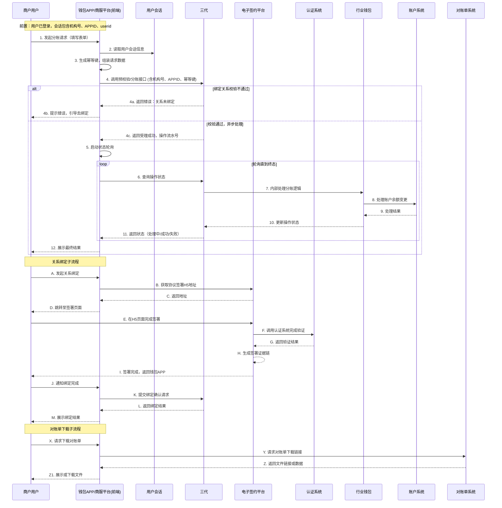

# 模块设计: 钱包APP/商服平台

生成时间: 2026-01-22 17:47:38
批判迭代: 2

---

# 钱包APP/商服平台 模块设计文档

## 1. 概述
- **目的与范围**: 本模块是面向商户（包括收单商户、非收单商户、总部、门店）和一般接收方的用户交互平台。其核心职责是提供账户管理（如开户申请、账户信息查询）、关系绑定、分账/归集/批量付款等资金操作发起、交易记录查询、对账单下载以及提现申请等功能。它是业务指令的发起端和结果展示端，不处理核心业务逻辑。
- **架构角色澄清**: 本模块是一个**前端应用（Web/APP）**，其“业务逻辑”章节描述的是前端需要处理的用户交互流程、数据验证和状态管理，不包含后端的核心业务规则处理。它通过调用后端服务（如三代、电子签约平台等）的接口来完成业务功能。

## 2. 接口设计
- **API端点 (REST/GraphQL)**: 本模块作为前端应用，主要消费后端服务提供的接口。以下是关键的后端接口依赖：
    - **三代接口**:
        - `POST /api/v3/account/open`: 发起开户申请。
        - `POST /api/v3/relation/bind`: 发起关系绑定请求。
        - `POST /api/v3/split/apply`: 发起分账/归集/批量付款请求。
        - `POST /api/v3/withdraw/apply`: 发起提现申请。
        - `GET /api/v3/account/balance`: 查询账户余额。
        - `GET /api/v3/transactions`: 查询交易流水。
        - `GET /api/v3/operation/status`: 查询异步操作状态。
    - **电子签约平台接口**:
        - `GET /esign/h5/url`: 获取协议签署H5页面地址。
    - **认证系统接口**:
        - `GET /auth/h5/url`: 获取打款验证或人脸验证H5页面地址。
    - **对账单系统接口**:
        - `GET /statement/download/url`: 获取对账单文件下载链接。
    - **用户中心接口**:
        - `GET /user/profile`: 获取当前用户身份信息。
- **请求/响应结构**: TBD（由各后端服务定义）。
- **发布/消费的事件**: 本模块作为前端应用，不直接发布领域事件。它通过轮询或WebSocket监听后端服务推送的操作结果通知。

## 3. 数据模型
- **表/集合**: 作为前端应用，本模块不直接操作数据库。其数据模型为**前端状态与视图模型**，用于管理界面状态和展示数据。
- **关键视图模型**:
    - **用户会话 (UserSession)**: 存储登录态、用户ID、角色（总部/门店/一般接收方）、所属机构号、APPID等信息。
    - **账户信息视图 (AccountView)**: 用于展示的账户数据，包括账户号、账户类型（天财收款账户/天财接收方账户）、状态、余额。
    - **交易指令表单 (TransactionForm)**: 用于收集用户发起的操作数据，如分账指令（付款方账户、接收方账户列表、金额、备注、幂等键）。
    - **操作状态视图 (OperationStatusView)**: 展示异步操作（如分账、提现）的当前状态（处理中/成功/失败）、结果码、结果信息。
    - **关系绑定视图 (RelationView)**: 展示已建立的绑定关系列表（如总部-门店、付款方-接收方）。
- **与其他模块的关系**: 本模块的视图数据通过调用后端业务核心、用户中心、对账单系统等模块的接口获取并组装。

## 4. 业务逻辑
- **核心工作流/算法**:
    1.  **开户申请**: 引导商户提交资料，组装请求数据（包含机构号、APPID），调用三代接口发起天财收款账户或天财接收方账户的开户流程。前端跟踪申请状态。
    2.  **关系绑定/开通付款**:
        - 前端根据用户角色和业务场景，确定需要签署的协议类型。
        - 调用电子签约平台接口，获取协议签署H5页面地址并引导用户完成签署。
        - 在签署流程中，电子签约平台会调用认证系统完成打款验证或人脸验证。
        - 签署完成后，前端调用三代接口提交绑定关系建立请求。
    3.  **分账/归集/批量付款发起**:
        - 用户填写指令表单。前端生成唯一的幂等键（idempotency_key）附加到请求中。
        - 提交前，前端校验表单必填项、金额格式，并调用三代接口预校验付款方与接收方绑定关系（或依赖接口返回校验）。
        - 提交后，调用三代分账接口。对于异步处理的操作，启动轮询机制查询状态，直至终态（成功/失败）。
    4.  **提现申请**: 用户发起提现。前端校验账户状态（通过查询接口）、提现金额不大于余额、已绑定有效银行卡（通过查询接口）。调用三代提现接口并轮询状态。
    5.  **查询与对账**: 调用三代接口查询账户余额、交易流水。调用对账单系统接口获取对账单下载链接。
- **业务规则与验证 (前端部分)**:
    - **权限校验**: 所有API调用需在请求头中携带用户会话信息（userid、机构号、APPID）。后端负责鉴权，前端根据用户角色（总部、门店、一般接收方）动态展示或隐藏功能菜单与操作按钮。
    - **数据校验**: 对用户输入进行基础格式校验（如金额为正数、账户号格式）。
    - **状态一致性**: 对于异步操作，通过轮询接口 (`GET /api/v3/operation/status`) 保持前端状态与后端一致，避免用户重复提交。
    - **幂等性**: 为所有创建型指令（分账、提现）的请求自动生成并附加幂等键，防止网络重试导致重复交易。
- **关键边界情况处理**:
    - 网络超时或后端服务不可用: 展示友好提示，记录操作状态为“提交中”，提供手动重试按钮（重试时使用原幂等键）。
    - 操作结果未知: 提供“查询状态”功能，允许用户手动触发状态轮询。
    - 页面刷新或重启: 从本地存储恢复未完成的操作状态，并自动重新轮询。

## 5. 时序图

## 6. 错误处理
- **预期错误情况**:
    - **网络与系统错误**: 接口调用超时、连接失败、网关错误（5xx）。
    - **业务逻辑错误**: 由后端返回，如：余额不足、账户冻结、绑定关系不存在、用户权限不足、重复请求（幂等键冲突）。
    - **用户输入错误**: 表单验证失败（前端拦截）、请求参数格式错误（后端返回4xx）。
    - **依赖服务错误**: 电子签约平台、认证系统等服务不可用或返回错误。
- **处理策略**:
    - **错误映射与展示**: 维护后端错误码到前端友好提示的映射表。对于未知错误，展示通用提示并记录错误ID供查询。
    - **重试机制**: 对于网络超时等可重试错误，提供“重试”按钮。重试请求必须携带原幂等键。
    - **状态恢复**: 因错误导致操作状态不明时，引导用户至“交易记录”页或提供专门的状态查询入口。
    - **降级方案**: 当非核心依赖（如对账单系统）不可用时，隐藏相关功能或提示“服务暂不可用”。
    - **日志记录**: 前端记录所有用户操作日志和接口错误日志（脱敏后），用于问题追踪。

## 7. 依赖关系
- **上游模块**:
    - **用户中心**: 提供用户登录认证和基础身份信息（userid）。**契约**: 用户登录态令牌、用户信息查询接口。
- **下游模块/服务 (本模块主动调用)**:
    - **三代**: 核心业务指令接口提供方。**契约**: 开户、绑定、分账、提现、查询等REST API。
    - **电子签约平台**: 电子协议签署服务提供方。**契约**: 协议签署H5页面地址接口。
    - **认证系统**: 身份核验服务提供方。**契约**: 通过电子签约平台间接调用，提供打款验证、人脸验证能力。
    - **对账单系统**: 对账单生成与下载服务提供方。**契约**: 对账单文件或下载链接接口。
    - **业务核心** (间接): 通过三代接口间接依赖，获取交易详情等数据。
- **横向依赖**:
    - **前端基础设施**: 如HTTP客户端、状态管理库、本地存储。