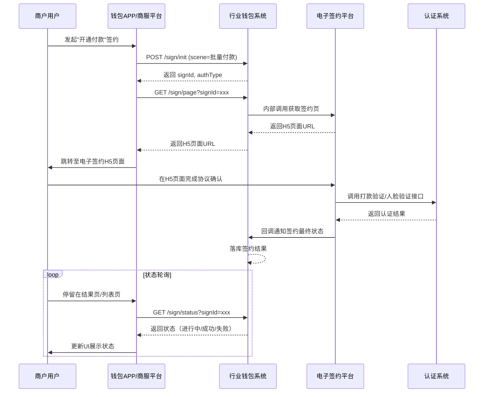

# 模块设计: 钱包APP/商服平台

生成时间: 2026-01-21 18:11:57
批判迭代: 2

---

# 钱包APP/商服平台 模块设计文档

## 1. 概述
- **目的与范围**: 本模块是面向商户（总部/门店）的前端应用平台，提供天财分账业务的可视化操作界面。核心职责包括：展示账户信息、发起分账请求（归集、批量付款、会员结算）、管理关系绑定与签约认证流程、查询交易记录与对账单。其边界止于业务请求的发起与结果展示，不包含后台业务逻辑处理。

## 2. 接口设计
- **API端点 (REST/GraphQL)**: 本模块通过调用后端REST API实现功能。所有接口需携带登录态Token进行鉴权，关键接口需提供幂等键。
    - `POST /api/v1/sign/init`: 签约初始化。根据场景获取签约流程ID及所需认证类型。
    - `GET /api/v1/sign/page`: 获取电子签约H5页面URL。
    - `GET /api/v1/sign/status`: 查询签约流程状态。
    - `POST /api/v1/transfer/collect`: 发起归集交易。
    - `POST /api/v1/transfer/batch`: 发起批量付款交易。
    - `POST /api/v1/transfer/member`: 发起会员结算交易。
    - `GET /api/v1/transfers`: 分页查询交易记录。
    - `GET /api/v1/accounts`: 查询账户信息与绑定关系。
    - `GET /api/v1/bills`: 查询对账单。
    - `GET /api/v1/error-codes`: 获取错误码映射表。
- **请求/响应结构**: 请求体统一包含`requestId`（幂等键）、`timestamp`。响应体包含`code`、`message`、`data`。分页请求包含`pageNo`、`pageSize`；分页响应包含`total`、`list`。
- **发布/消费的事件**: 前端不直接消费事件。状态更新采用轮询机制，轮询间隔为5秒，当状态进入终态（成功/失败）或超时（如30分钟）后停止。后端接收电子签约平台回调后，前端通过轮询查询接口获取最新状态。

## 3. 数据模型
- **表/集合**: 前端不直接持有核心业务数据表。本地存储用于缓存和草稿，包含以下结构：
    - `local_cache`: 缓存账户信息、关系列表、错误码映射，有效期5分钟。
    - `local_draft`: 保存未提交的分账请求草稿，包含场景、付方、收方列表、金额、资金用途等字段，加密存储，有效期7天。
- **关键字段**:
    - **账户信息**: `accountNo`（账户号）, `accountName`（账户名）, `roleType`（角色类型：总部/门店）, `status`（状态）。
    - **签约流程**: `signId`（流程ID）, `scene`（场景）, `authType`（认证类型）, `status`（进行中/成功/失败）。
    - **交易单**: `transferId`（交易ID）, `batchNo`（批次号）, `scene`, `payer`（付方）, `payee`（收方）, `amount`, `feeBearer`（手续费承担方）, `arrivalMode`（到账模式）, `purpose`（资金用途）, `status`。
    - **草稿**: `draftId`, `scene`, `formData`（表单JSON）, `lastSavedTime`。
- **与其他模块的关系**: 本模块作为前端应用，其展示的数据来源于**行业钱包系统**、**账户系统**、**对账单系统**等后端模块。前端模型字段与后端接口返回字段一一映射。

## 4. 业务逻辑
- **核心工作流/算法**:
    1.  **关系绑定/签约认证流程**: 引导用户完成特定场景（如开通付款）下的协议签署与身份认证（打款验证、人脸验证）。根据场景选择对应的协议模板。
    2.  **分账请求发起**: 根据用户选择的**场景**（归集、批量付款、会员结算），收集付方、收方、金额、**资金用途**、**手续费承担方**、**到账模式**等信息，提交至**行业钱包系统**。批量付款支持上传文件或手动添加。
    3.  **状态查询与展示**: 通过轮询接口查询分账交易、签约流程的状态并展示给用户。
- **业务规则与验证**:
    - 前端校验必填字段、金额格式（正数、两位小数）、账户状态（需为正常）等。
    - 根据**场景**和**角色类型**（总部/门店）控制页面元素与流程的可见性。总部可见所有场景；门店仅可见归集（作为付方）。
    - 在发起**批量付款**或**会员结算**前，校验付方（总部）是否已完成"开通付款"所需的签约认证。
    - **资金用途**与**场景**关联，用于选择对应的协议模板。
    - **手续费承担方**（付方/收方）和**到账模式**（净额/全额）根据业务规则展示默认值并允许用户选择（如适用）。
- **关键边界情况处理**:
    - 网络中断时，本地保存草稿（自动保存与手动保存）。
    - 接口调用超时或失败时，提供明确的重试（最多3次）或反馈机制。
    - 处理**行业钱包系统**返回的业务校验失败（如余额不足、账户状态异常），展示对应错误码映射信息。
    - 批量付款部分失败时，展示失败明细并提供针对失败条目的重试入口。

## 5. 时序图

*注：账户查询、交易发起、账单查询等时序类似，均为APP直接调用WS接口。*

## 6. 错误处理
- **预期错误情况**:
    - 网络异常或服务不可用。
    - 用户输入数据格式错误。
    - 后端业务校验失败（如账户不存在、权限不足、余额不足、签约未完成）。
    - 签约认证流程中断或失败。
    - 接口调用超时。
    - 批量处理部分失败。
- **处理策略**:
    - 对网络和服务错误进行友好提示，并提供重试选项。实现请求重试机制（最多3次）。
    - 前端进行输入格式校验，并给出明确错误提示。
    - 将后端返回的业务错误码通过映射表转换为用户可理解的信息进行展示。
    - 记录签约流程中断点（通过保存signId），支持用户从断点继续或重新开始。
    - 登录Token过期时，跳转统一登录页重新认证。
    - 敏感信息（如银行卡号、身份证号）展示时进行脱敏处理。
    - 所有提交类接口使用`requestId`作为幂等键，防止重复提交。
    - 从电子签约H5页面回跳时，校验回跳参数签名，防止篡改。

## 7. 依赖关系
- **上游模块**:
    - **行业钱包系统**: 核心依赖，提供所有业务接口（签约、交易、查询）。
    - **电子签约平台**: 间接依赖，通过行业钱包系统集成，提供签约H5页面。
    - **账户系统**: 间接依赖，账户信息通过行业钱包系统透传。
    - **对账单系统**: 间接依赖，账单数据通过行业钱包系统透传。
    - **统一登录平台**: 依赖其提供用户登录、会话管理及Token刷新机制。
    - **风控系统**: 间接依赖，行业钱包系统调用。
    - **埋点系统**: 依赖其进行用户行为数据采集。
    - **消息推送系统**: 依赖其向APP推送重要通知（可作为轮询的补充）。
- **下游模块**: 本模块为纯前端应用，无下游模块。