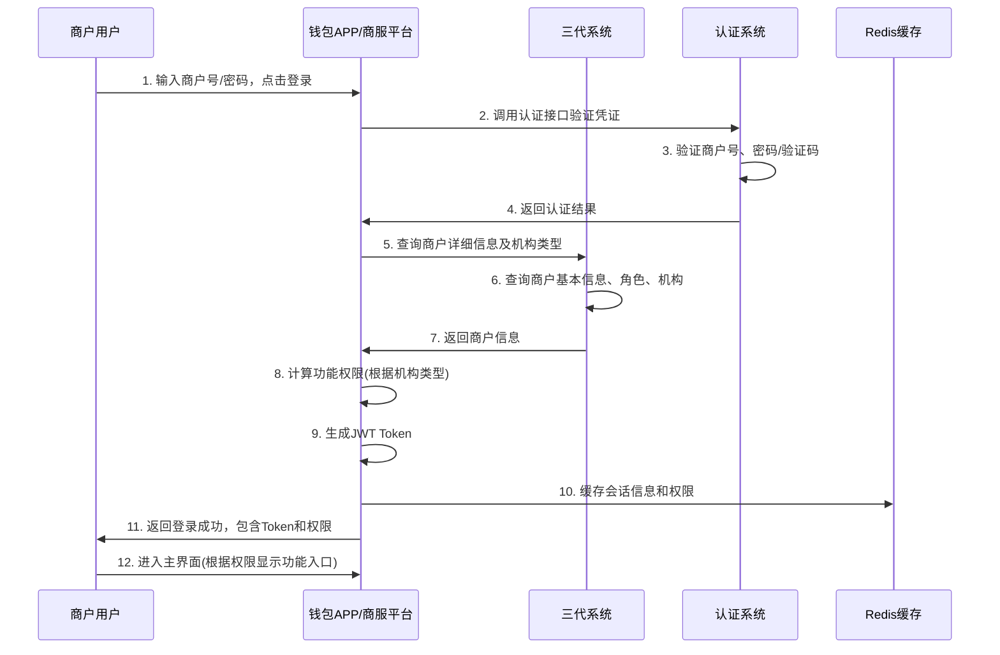
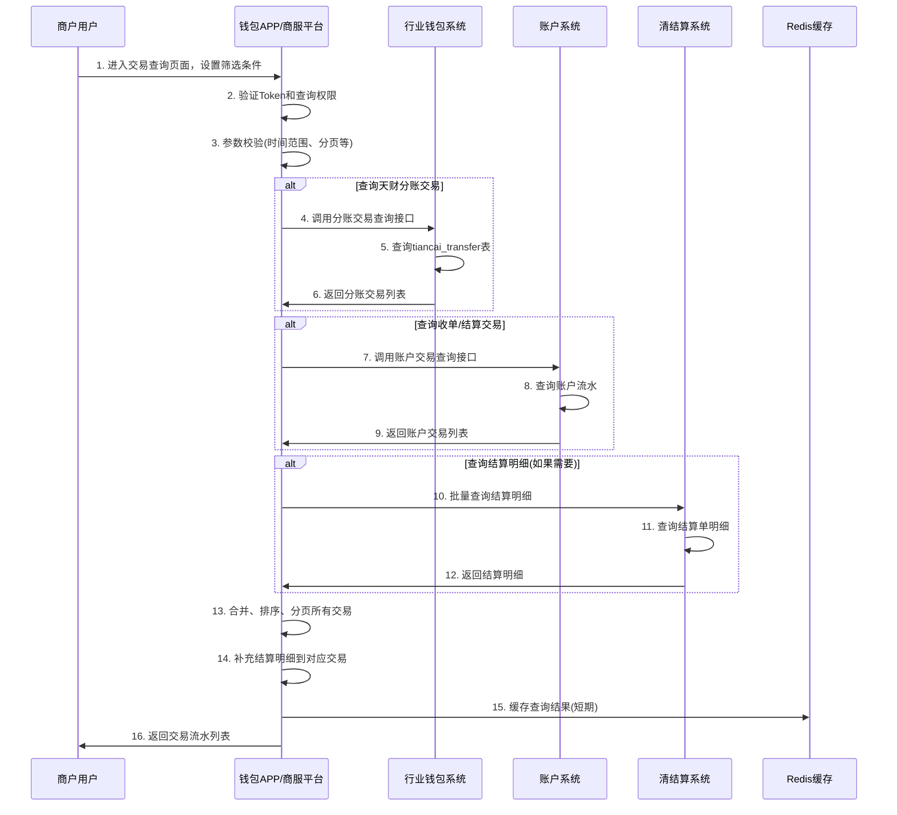
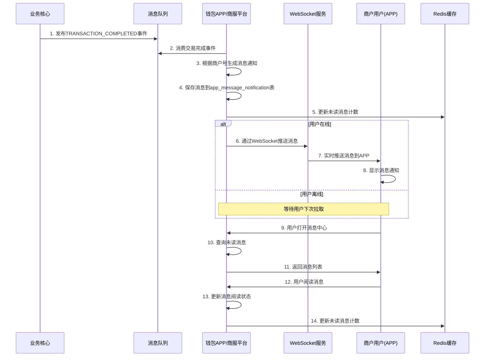

# 模块设计: 钱包APP/商服平台

生成时间: 2026-01-16 17:24:03

---

# 模块设计: 钱包APP/商服平台

生成时间: 2024年1月

---

## 1. 概述

### 1.1 目的
钱包APP/商服平台作为面向商户（总部/门店）和接收方（供应商/股东等）的客户端服务模块，负责：
1. **商户自助服务**：为天财机构下的商户提供账户管理、交易查询、提现等基础功能。
2. **业务入口管控**：根据天财业务模式要求，对特定机构下的商户关闭非必要的业务入口（如提现、结算模式切换），确保资金流转符合天财业务规范。
3. **用户体验优化**：为天财商户提供定制化的界面和流程，简化操作，提升使用体验。
4. **安全与权限管理**：实现基于商户角色（总部/门店）和机构类型的差异化权限控制。

### 1.2 范围
- **登录与权限控制**：支持商户登录，并根据机构类型（天财新机构）动态控制功能入口的可见性。
- **账户信息展示**：展示天财专用账户（收款账户、接收方账户）的基本信息、余额、交易流水。
- **提现功能管理**：
    - 为普通商户提供实时提现功能。
    - 对天财新机构下的商户，**关闭提现入口**，资金流转由天财系统通过分账接口控制。
- **结算模式管理**：
    - 为普通商户提供结算模式（主动/被动）查看与切换功能。
    - 对天财新机构下的商户，**关闭结算模式切换入口**，结算模式由三代系统统一配置。
- **交易查询**：提供天财分账交易、收单交易、结算明细的查询功能。
- **消息通知**：展示业务相关通知（如认证结果、协议签署提醒）。

**边界说明**：
- **上游**：账户系统（查询余额、流水）、清结算系统（查询结算单）、行业钱包系统（业务数据）、认证系统（辅助登录）。
- **下游**：商户用户（总部、门店、接收方）。
- **不负责**：业务逻辑处理（由后端系统负责）、费率配置（三代负责）、协议签署（电子签约平台H5嵌入）。

## 2. 接口设计

### 2.1 API端点 (REST)

#### 2.1.1 商户登录与权限获取
- **端点**：`POST /api/v1/app/auth/login`
- **描述**：商户使用商户号/手机号+密码/验证码登录。登录成功后，返回商户基本信息及根据机构类型计算的功能权限列表。
- **请求体**：
  ```json
  {
    "loginType": "MERCHANT_NO | MOBILE", // 登录方式：商户号 | 手机号
    "username": "8888880001", // 商户号或手机号
    "password": "encrypted_password", // 密码（当loginType=MERCHANT_NO时）
    "smsCode": "123456", // 短信验证码（当loginType=MOBILE时）
    "deviceId": "device_unique_id"
  }
  ```
- **响应体** (成功)：
  ```json
  {
    "code": "SUCCESS",
    "message": "登录成功",
    "data": {
      "token": "jwt_token",
      "expireTime": "2024-01-01 12:00:00",
      "merchantInfo": {
        "merchantNo": "8888880001",
        "merchantName": "北京天财餐饮总部",
        "merchantType": "ENTERPRISE",
        "roleType": "HEADQUARTERS", // 总部 | 门店
        "orgId": "TC20240001",
        "orgType": "TIANCAI_NEW | TIANCAI_OLD | NORMAL", // 天财新机构 | 天财老机构 | 普通机构
        "tiancaiReceiveAccountNo": "TTRA888888000001",
        "defaultBankCardNo": "6228480012345678901"
      },
      "permissions": {
        "withdrawEnabled": false, // 提现功能是否可用（天财新机构为false）
        "settlementModeSwitchEnabled": false, // 结算模式切换是否可用（天财新机构为false）
        "accountManagementEnabled": true, // 账户管理是否可用
        "transactionQueryEnabled": true // 交易查询是否可用
      }
    }
  }
  ```

#### 2.1.2 查询账户余额与概览
- **端点**：`GET /api/v1/app/account/overview`
- **描述**：查询当前登录商户的账户概览信息，包括余额、可用余额、冻结金额等。
- **认证**：JWT Token (Authorization头)
- **响应体**：
  ```json
  {
    "code": "SUCCESS",
    "data": {
      "merchantNo": "8888880001",
      "accountNo": "TTRA888888000001",
      "accountType": "RECEIVE_ACCOUNT",
      "accountName": "北京天财餐饮总部",
      "balance": "100000.00", // 账户余额
      "availableBalance": "98000.00", // 可用余额
      "frozenAmount": "2000.00", // 冻结金额
      "todayIncome": "5000.00", // 今日收入
      "todayExpenditure": "3000.00", // 今日支出
      "bankCardInfo": {
        "bankCardNo": "6228480012345678901",
        "bankName": "中国农业银行",
        "bankCode": "ABC"
      }
    }
  }
  ```

#### 2.1.3 查询交易流水
- **端点**：`POST /api/v1/app/transaction/query`
- **描述**：分页查询交易流水，支持按交易类型、时间范围筛选。
- **请求体**：
  ```json
  {
    "pageNum": 1,
    "pageSize": 20,
    "startTime": "2024-01-01 00:00:00",
    "endTime": "2024-01-31 23:59:59",
    "transactionType": "TIANCAI_SPLIT | RECEIVE | WITHDRAW | SETTLEMENT", // 天财分账 | 收款 | 提现 | 结算
    "minAmount": "0.00",
    "maxAmount": "10000.00"
  }
  ```
- **响应体**：
  ```json
  {
    "code": "SUCCESS",
    "data": {
      "total": 150,
      "pageNum": 1,
      "pageSize": 20,
      "list": [
        {
          "transactionNo": "TF202401160001",
          "transactionType": "TIANCAI_SPLIT",
          "transactionSubType": "BATCH_PAY", // 场景：归集、批量付款、会员结算
          "amount": "1000.00",
          "feeAmount": "3.00",
          "netAmount": "997.00",
          "counterpartyMerchantNo": "8888880002",
          "counterpartyMerchantName": "上海天财门店",
          "counterpartyAccountNo": "TTRC888888000001",
          "direction": "OUT", // IN: 收入, OUT: 支出
          "balanceAfter": "99000.00", // 交易后余额
          "status": "SUCCESS",
          "remark": "股东分红",
          "transactionTime": "2024-01-01 10:30:00"
        },
        {
          "transactionNo": "ST202401160001",
          "transactionType": "SETTLEMENT",
          "transactionSubType": "D1_BATCH", // D+1批结
          "amount": "5000.00",
          "feeAmount": "15.00",
          "netAmount": "4985.00",
          "counterpartyMerchantNo": null,
          "counterpartyMerchantName": null,
          "counterpartyAccountNo": "待结算账户",
          "direction": "IN",
          "balanceAfter": "104000.00",
          "status": "SUCCESS",
          "remark": "收单结算",
          "transactionTime": "2024-01-02 09:00:00",
          "settlementDetails": [ // 结算明细（当transactionType=SETTLEMENT时返回）
            {
              "orderNo": "ORD202401010001",
              "orderAmount": "100.00",
              "settlementAmount": "99.70",
              "feeAmount": "0.30",
              "orderTime": "2024-01-01 12:30:00"
            }
          ]
        }
      ]
    }
  }
  ```

#### 2.1.4 发起提现（条件开放）
- **端点**：`POST /api/v1/app/withdraw/apply`
- **描述**：商户发起实时提现申请。**注意：对于天财新机构下的商户，此接口在前端应隐藏或禁用，后端也会校验权限。**
- **权限校验**：检查`permissions.withdrawEnabled`是否为true。
- **请求体**：
  ```json
  {
    "accountNo": "TTRA888888000001",
    "amount": "1000.00",
    "bankCardNo": "6228480012345678901", // 可指定其他已绑定的银行卡
    "remark": "日常提现"
  }
  ```
- **响应体** (成功)：
  ```json
  {
    "code": "SUCCESS",
    "message": "提现申请提交成功",
    "data": {
      "withdrawNo": "WD202401160001",
      "accountNo": "TTRA888888000001",
      "amount": "1000.00",
      "estimatedArrivalTime": "2024-01-01 10:35:00",
      "status": "PROCESSING"
    }
  }
  ```

#### 2.1.5 查询结算模式（仅查看）
- **端点**：`GET /api/v1/app/settlement/mode`
- **描述**：查询当前商户的结算模式信息。**对于天财新机构下的商户，只允许查看，不允许修改。**
- **响应体**：
  ```json
  {
    "code": "SUCCESS",
    "data": {
      "merchantNo": "8888880001",
      "settlementMode": "ACTIVE", // ACTIVE: 主动结算, PASSIVE: 被动结算
      "settlementAccountNo": "TTRA888888000001",
      "settlementAccountType": "TIANCAI_RECEIVE_ACCOUNT",
      "switchable": false, // 是否允许切换（天财新机构为false）
      "nextSettlementTime": "2024-01-03 09:00:00" // 下次结算时间
    }
  }
  ```

#### 2.1.6 查询绑定关系状态
- **端点**：`GET /api/v1/app/relations/status`
- **描述**：查询当前商户作为付方或收方的绑定关系状态，用于展示“开通付款”等业务的完成情况。
- **响应体**：
  ```json
  {
    "code": "SUCCESS",
    "data": {
      "asPayerRelations": [ // 作为付款方的绑定关系
        {
          "relationId": "REL_202401160001",
          "scene": "BATCH_PAY",
          "payeeMerchantNo": "8888880002",
          "payeeMerchantName": "供应商A",
          "payeeAccountNo": "TTRC888888000001",
          "fundPurpose": "货款结算",
          "bindStatus": "ACTIVE", // 绑定状态
          "protocolStatus": "SIGNED",
          "activeTime": "2024-01-01 10:35:00"
        }
      ],
      "asPayeeRelations": [ // 作为收款方的绑定关系
        {
          "relationId": "REL_202401160002",
          "scene": "POOLING",
          "payerMerchantNo": "8888880003",
          "payerMerchantName": "上海门店",
          "payerAccountNo": "TTRA888888000003",
          "fundPurpose": "营业款归集",
          "bindStatus": "ACTIVE",
          "protocolStatus": "SIGNED",
          "activeTime": "2024-01-01 11:00:00"
        }
      ],
      "paymentEnabled": true // 是否已开通付款（针对批量付款/会员结算场景的付方）
    }
  }
  ```

### 2.2 消费的事件

#### 2.2.1 账户余额变更事件 (`ACCOUNT_BALANCE_CHANGED`)
- **来源**：账户系统
- **用途**：实时更新本地缓存的账户余额，用于前端展示刷新。
- **事件格式**：
  ```json
  {
    "eventId": "EVT_BAL_202401160001",
    "eventType": "ACCOUNT_BALANCE_CHANGED",
    "timestamp": "2024-01-01T10:30:00Z",
    "data": {
      "accountNo": "TTRA888888000001",
      "merchantNo": "8888880001",
      "oldBalance": "100000.00",
      "newBalance": "99000.00",
      "changeAmount": "-1000.00",
      "changeType": "TRANSFER_OUT", // 转账支出
      "transactionNo": "TF202401160001",
      "changeTime": "2024-01-01 10:30:00"
    }
  }
  ```

#### 2.2.2 绑定关系状态变更事件 (`RELATION_STATUS_CHANGED`)
- **来源**：行业钱包系统
- **用途**：更新本地缓存的绑定关系状态，用于前端状态同步。
- **事件格式**：
  ```json
  {
    "eventId": "EVT_REL_202401160001",
    "eventType": "RELATION_STATUS_CHANGED",
    "timestamp": "2024-01-01T10:35:00Z",
    "data": {
      "relationId": "REL_202401160001",
      "payerMerchantNo": "8888880001",
      "payeeMerchantNo": "8888880002",
      "oldStatus": "PROCESSING",
      "newStatus": "ACTIVE",
      "changeTime": "2024-01-01 10:35:00"
    }
  }
  ```

#### 2.2.3 交易完成事件 (`TRANSACTION_COMPLETED`)
- **来源**：业务核心/行业钱包系统
- **用途**：通知前端有新交易完成，可用于刷新交易列表或推送通知。
- **事件格式**：
  ```json
  {
    "eventId": "EVT_TXN_202401160001",
    "eventType": "TRANSACTION_COMPLETED",
    "timestamp": "2024-01-01T10:30:00Z",
    "data": {
      "transactionNo": "TF202401160001",
      "merchantNo": "8888880001",
      "accountNo": "TTRA888888000001",
      "transactionType": "TIANCAI_SPLIT",
      "amount": "1000.00",
      "direction": "OUT",
      "counterpartyName": "上海天财门店",
      "transactionTime": "2024-01-01 10:30:00"
    }
  }
  ```

## 3. 数据模型

### 3.1 数据库表设计

#### 表：`app_merchant_session` (商户会话表)
| 字段名 | 类型 | 必填 | 默认值 | 说明 |
|--------|------|------|--------|------|
| id | bigint | Y | AUTO_INCREMENT | 主键 |
| session_id | varchar(64) | Y | | 会话ID (JWT jti) |
| merchant_no | varchar(32) | Y | | 商户号 |
| token | text | Y | | JWT Token |
| device_id | varchar(64) | N | | 设备ID |
| device_type | varchar(20) | N | | 设备类型：IOS, ANDROID, WEB |
| login_ip | varchar(45) | N | | 登录IP |
| login_time | datetime | Y | CURRENT_TIMESTAMP | 登录时间 |
| last_active_time | datetime | Y | CURRENT_TIMESTAMP | 最后活跃时间 |
| expire_time | datetime | Y | | Token过期时间 |
| status | varchar(20) | Y | ACTIVE | 状态：ACTIVE, LOGGED_OUT, EXPIRED |
| create_time | datetime | Y | CURRENT_TIMESTAMP | 创建时间 |
| update_time | datetime | Y | CURRENT_TIMESTAMP ON UPDATE | 更新时间 |

**索引**：
- 唯一索引：`uk_session_id` (session_id)
- 普通索引：`idx_merchant_no` (merchant_no)
- 普通索引：`idx_expire_time` (expire_time)

#### 表：`app_merchant_config` (商户客户端配置表)
| 字段名 | 类型 | 必填 | 默认值 | 说明 |
|--------|------|------|--------|------|
| id | bigint | Y | AUTO_INCREMENT | 主键 |
| merchant_no | varchar(32) | Y | | 商户号 |
| config_type | varchar(30) | Y | | 配置类型：UI_FEATURE, NOTIFICATION, DISPLAY |
| config_key | varchar(50) | Y | | 配置键 |
| config_value | text | Y | | 配置值 (JSON格式) |
| effective_time | datetime | Y | | 生效时间 |
| expire_time | datetime | N | | 失效时间 |
| status | varchar(20) | Y | ACTIVE | 状态：ACTIVE, INACTIVE |
| create_time | datetime | Y | CURRENT_TIMESTAMP | 创建时间 |
| update_time | datetime | Y | CURRENT_TIMESTAMP ON UPDATE | 更新时间 |

**索引**：
- 唯一索引：`uk_merchant_config` (merchant_no, config_type, config_key, effective_time)
- 普通索引：`idx_merchant_type` (merchant_no, config_type)

#### 表：`app_message_notification` (消息通知表)
| 字段名 | 类型 | 必填 | 默认值 | 说明 |
|--------|------|------|--------|------|
| id | bigint | Y | AUTO_INCREMENT | 主键 |
| message_id | varchar(32) | Y | | 消息ID |
| merchant_no | varchar(32) | Y | | 目标商户号 |
| message_type | varchar(30) | Y | | 消息类型：TRANSACTION, RELATION, SYSTEM, PROMOTION |
| title | varchar(100) | Y | | 消息标题 |
| content | text | Y | | 消息内容 |
| link_url | varchar(500) | N | | 跳转链接 |
| link_params | json | N | | 链接参数 |
| read_status | varchar(20) | Y | UNREAD | 阅读状态：UNREAD, READ |
| send_time | datetime | Y | CURRENT_TIMESTAMP | 发送时间 |
| read_time | datetime | N | | 阅读时间 |
| expire_time | datetime | N | | 过期时间 |
| status | varchar(20) | Y | VALID | 状态：VALID, INVALID |
| create_time | datetime | Y | CURRENT_TIMESTAMP | 创建时间 |

**索引**：
- 唯一索引：`uk_message_id` (message_id)
- 普通索引：`idx_merchant_read` (merchant_no, read_status, send_time)
- 普通索引：`idx_send_time` (send_time)

#### 表：`app_operation_log` (客户端操作日志表)
| 字段名 | 类型 | 必填 | 默认值 | 说明 |
|--------|------|------|--------|------|
| id | bigint | Y | AUTO_INCREMENT | 主键 |
| log_id | varchar(32) | Y | | 日志ID |
| merchant_no | varchar(32) | Y | | 操作商户号 |
| session_id | varchar(64) | N | | 会话ID |
| operation_type | varchar(50) | Y | | 操作类型：LOGIN, LOGOUT, WITHDRAW_APPLY, QUERY, etc. |
| operation_target | varchar(50) | Y | | 操作目标：ACCOUNT, TRANSACTION, RELATION, etc. |
| request_params | json | N | | 请求参数 |
| response_result | json | N | | 响应结果 |
| ip_address | varchar(45) | N | | 操作IP |
| user_agent | varchar(500) | N | | User-Agent |
| device_id | varchar(64) | N | | 设备ID |
| status | varchar(20) | Y | SUCCESS | 状态：SUCCESS, FAILED |
| error_code | varchar(20) | N | | 错误码 |
| error_message | varchar(200) | N | | 错误信息 |
| operation_time | datetime | Y | CURRENT_TIMESTAMP | 操作时间 |
| create_time | datetime | Y | CURRENT_TIMESTAMP | 创建时间 |

**索引**：
- 唯一索引：`uk_log_id` (log_id)
- 普通索引：`idx_merchant_operation` (merchant_no, operation_type, operation_time)
- 普通索引：`idx_operation_time` (operation_time)

### 3.2 缓存设计 (Redis)

#### 键设计：
1. **商户权限缓存**：`wallet:app:merchant:perms:{merchantNo}` 
   - 值：`{"withdrawEnabled":false,"settlementModeSwitchEnabled":false,...}` 
   - TTL: 1小时
2. **账户余额缓存**：`wallet:app:account:balance:{accountNo}`
   - 值：`{"balance":"100000.00","availableBalance":"98000.00",...}`
   - TTL: 5分钟
3. **会话Token缓存**：`wallet:app:session:{sessionId}`
   - 值：`{"merchantNo":"8888880001","expireTime":"2024-01-01 12:00:00"}`
   - TTL: 与JWT过期时间一致
4. **消息未读数缓存**：`wallet:app:message:unread:{merchantNo}`
   - 值：`{"count":5}`
   - TTL: 1小时

### 3.3 与其他模块的关系
```mermaid
erDiagram
    APP_MERCHANT_SESSION ||--o{ APP_OPERATION_LOG : "记录"
    APP_MERCHANT_CONFIG ||--o{ APP_MERCHANT_SESSION : "影响权限"
    
    WALLET_APP_SYSTEM }|--|| ACCOUNT_SYSTEM : "查询余额/流水"
    WALLET_APP_SYSTEM }|--|| SETTLEMENT_SYSTEM : "查询结算模式/明细"
    WALLET_APP_SYSTEM }|--|| WALLET_SYSTEM : "查询绑定关系"
    WALLET_APP_SYSTEM }|--|| GENERATION_3_SYSTEM : "查询机构类型"
    WALLET_APP_SYSTEM }|..|> ACCOUNT_SYSTEM : "监听余额事件"
    WALLET_APP_SYSTEM }|..|> WALLET_SYSTEM : "监听关系事件"
    WALLET_APP_SYSTEM }|..|> BUSINESS_CORE : "监听交易事件"
    
    WALLET_APP_SYSTEM {
        varchar system_id PK
    }
    
    ACCOUNT_SYSTEM {
        varchar system_id PK
    }
    
    SETTLEMENT_SYSTEM {
        varchar system_id PK
    }
    
    WALLET_SYSTEM {
        varchar system_id PK
    }
    
    GENERATION_3_SYSTEM {
        varchar system_id PK
    }
    
    BUSINESS_CORE {
        varchar system_id PK
    }
```

## 4. 业务逻辑

### 4.1 核心算法

#### 4.1.1 商户功能权限计算算法
```java
public MerchantPermissions calculatePermissions(MerchantInfo merchantInfo) {
    MerchantPermissions permissions = new MerchantPermissions();
    
    // 1. 基础功能默认开启
    permissions.setAccountManagementEnabled(true);
    permissions.setTransactionQueryEnabled(true);
    permissions.setRelationQueryEnabled(true);
    permissions.setMessageCenterEnabled(true);
    
    // 2. 根据机构类型控制特定功能
    String orgType = merchantInfo.getOrgType();
    
    if ("TIANCAI_NEW".equals(orgType)) {
        // 天财新机构：关闭提现和结算模式切换
        permissions.setWithdrawEnabled(false);
        permissions.setSettlementModeSwitchEnabled(false);
        permissions.setShowWithdrawEntry(false); // 前端隐藏入口
        permissions.setShowSettlementModeEntry(false);
    } else if ("TIANCAI_OLD".equals(orgType)) {
        // 天财老机构：可能部分限制，根据业务要求配置
        permissions.setWithdrawEnabled(true);
        permissions.setSettlementModeSwitchEnabled(false); // 老机构通常也不允许切换
    } else {
        // 普通机构：全部功能开放
        permissions.setWithdrawEnabled(true);
        permissions.setSettlementModeSwitchEnabled(true);
        permissions.setShowWithdrawEntry(true);
        permissions.setShowSettlementModeEntry(true);
    }
    
    // 3. 根据商户角色调整（可选）
    if ("STORE".equals(merchantInfo.getRoleType())) {
        // 门店可能有一些特殊限制
        permissions.setBatchPayInitiateEnabled(false); // 门店不能发起批量付款
    }
    
    return permissions;
}
```

#### 4.1.2 交易流水查询与聚合算法
```java
public PaginatedResult<TransactionVO> queryTransactions(TransactionQueryRequest request) {
    // 1. 参数校验与默认值设置
    validateQueryRequest(request);
    
    // 2. 根据交易类型路由到不同的数据源
    List<TransactionVO> transactions = new ArrayList<>();
    
    if (request.getTransactionType() == null || 
        "TIANCAI_SPLIT".equals(request.getTransactionType())) {
        // 天财分账交易：从行业钱包系统查询
        transactions.addAll(queryTiancaiSplitTransactions(request));
    }
    
    if (request.getTransactionType() == null || 
        "RECEIVE".equals(request.getTransactionType()) ||
        "SETTLEMENT".equals(request.getTransactionType())) {
        // 收单和结算交易：从账户系统查询
        transactions.addAll(queryAccountTransactions(request));
    }
    
    if (request.getTransactionType() == null ||
        "WITHDRAW".equals(request.getTransactionType())) {
        // 提现交易：从账户系统查询
        transactions.addAll(queryWithdrawTransactions(request));
    }
    
    // 3. 合并、排序、分页
    transactions.sort(Comparator.comparing(TransactionVO::getTransactionTime).reversed());
    
    // 4. 如果是结算交易，获取结算明细
    enrichSettlementDetails(transactions);
    
    return paginate(transactions, request.getPageNum(), request.getPageSize());
}

private void enrichSettlementDetails(List<TransactionVO> transactions) {
    List<String> settlementTransactionNos = transactions.stream()
        .filter(tx -> "SETTLEMENT".equals(tx.getTransactionType()))
        .map(TransactionVO::getTransactionNo)
        .collect(Collectors.toList());
    
    if (!settlementTransactionNos.isEmpty()) {
        Map<String, List<SettlementDetailVO>> detailsMap = 
            settlementService.batchQuerySettlementDetails(settlementTransactionNos);
        
        transactions.forEach(tx -> {
            if (detailsMap.containsKey(tx.getTransactionNo())) {
                tx.setSettlementDetails(detailsMap.get(tx.getTransactionNo()));
            }
        });
    }
}
```

### 4.2 业务规则

#### 4.2.1 天财新机构功能限制规则
1. **提现功能**：
   - 前端界面隐藏"提现"入口。
   - 后端接口`/api/v1/app/withdraw/apply`增加权限校验，如果`permissions.withdrawEnabled=false`则返回错误。
   - 资金流出只能通过天财系统的分账接口完成。

2. **结算模式管理**：
   - 前端界面隐藏"结算模式切换"入口。
   - 后端接口`/api/v1/app/settlement/mode/switch`（如果存在）对天财新机构返回错误。
   - 结算模式由三代系统统一配置和管理。

3. **登录入口控制**：
   - 支持通过配置完全关闭天财新机构的登录入口（极端情况）。
   - 通常仍允许登录，但功能受限。

#### 4.2.2 交易流水展示规则
1. **交易类型分类**：
   - 天财分账：展示场景（归集、批量付款、会员结算）、收付方信息、手续费明细。
   - 收单结算：展示结算明细（子账单），支持展开查看每笔订单。
   - 提现：展示提现到账时间、状态。

2. **余额计算**：
   - 实时展示账户余额、可用余额、冻结金额。
   - 交易流水中的"交易后余额"字段需准确反映当时余额。

3. **时间排序**：
   - 默认按交易时间倒序排列。
   - 支持按时间范围筛选。

#### 4.2.3 消息通知规则
1. **通知类型**：
   - 交易通知：分账交易完成、提现到账、结算到账。
   - 业务通知：绑定关系激活、协议待签署、认证结果。
   - 系统通知：系统维护、功能更新。

2. **推送时机**：
   - 实时推送：通过WebSocket或长连接推送重要交易通知。
   - 定时拉取：非实时通知通过接口拉取。

3. **阅读状态**：
   - 未读消息计数展示。
   - 消息阅读后标记已读。

#### 4.2.4 安全与权限规则
1. **会话管理**：
   - JWT Token有效期24小时。
   - 支持多点登录，但同一设备唯一会话。
   - 长时间无操作自动登出。

2. **操作日志**：
   - 记录关键操作（登录、提现申请、敏感信息查询）。
   - 日志保留180天。

3. **权限验证**：
   - 每次接口调用验证Token有效性。
   - 敏感操作验证功能权限。

### 4.3 验证逻辑

#### 4.3.1 提现申请验证
```java
public void validateWithdrawApply(WithdrawApplyRequest request, MerchantInfo merchantInfo) {
    // 1. 基础参数校验
    Validate.notNull(request.getAmount(), "提现金额不能为空");
    Validate.isTrue(request.getAmount().compareTo(BigDecimal.ZERO) > 0, "提现金额必须大于0");
    
    // 2. 权限校验
    if (!merchantInfo.getPermissions().isWithdrawEnabled()) {
        throw new BusinessException("当前商户不允许提现", "APP_403001");
    }
    
    // 3. 账户校验
    AccountInfo account = accountService.getAccountInfo(request.getAccountNo());
    Validate.notNull(account, "账户不存在");
    Validate.isTrue(account.getMerchantNo().equals(merchantInfo.getMerchantNo()), 
                   "不能操作其他商户的账户");
    Validate.isTrue("NORMAL".equals(account.getStatus()), "账户状态异常");
    
    // 4. 余额校验
    Validate.isTrue(account.getAvailableBalance().compareTo(request.getAmount()) >= 0, 
                   "可用余额不足");
    
    // 5. 银行卡校验（如果指定了非默认卡）
    if (StringUtils.isNotBlank(request.getBankCardNo()) && 
        !request.getBankCardNo().equals(merchantInfo.getDefaultBankCardNo())) {
        BankCardInfo card = bankCardService.getBankCardInfo(
            merchantInfo.getMerchantNo(), request.getBankCardNo());
        Validate.notNull(card, "银行卡不存在或未绑定");
        Validate.isTrue(card.isActive(), "银行卡状态异常");
    }
    
    // 6. 限额校验
    validateWithdrawLimit(merchantInfo.getMerchantNo(), request.getAmount());
}
```

#### 4.3.2 交易查询权限验证
```java
public void validateTransactionQuery(TransactionQueryRequest request, MerchantInfo merchantInfo) {
    // 1. 时间范围校验
    if (request.getStartTime() != null && request.getEndTime() != null) {
        Validate.isTrue(!request.getStartTime().after(request.getEndTime()), 
                       "开始时间不能晚于结束时间");
        
        // 限制查询时间范围不超过90天
        long daysBetween = ChronoUnit.DAYS.between(
            request.getStartTime().toLocalDate(), 
            request.getEndTime().toLocalDate());
        Validate.isTrue(daysBetween <= 90, "查询时间范围不能超过90天");
    }
    
    // 2. 金额范围校验
    if (request.getMinAmount() != null && request.getMaxAmount() != null) {
        Validate.isTrue(request.getMinAmount().compareTo(request.getMaxAmount()) <= 0, 
                       "最小金额不能大于最大金额");
    }
    
    // 3. 分页参数校验
    Validate.isTrue(request.getPageNum() > 0, "页码必须大于0");
    Validate.isTrue(request.getPageSize() > 0 && request.getPageSize() <= 100, 
                   "每页条数必须在1-100之间");
}
```

## 5. 时序图

### 5.1 商户登录与权限获取时序图


### 5.2 交易流水查询时序图


### 5.3 实时消息推送时序图


## 6. 错误处理

### 6.1 预期错误码

| 错误码 | HTTP状态码 | 描述 | 处理建议 |
|--------|------------|------|----------|
| APP_400001 | 400 | 请求参数校验失败 | 检查请求参数格式和必填项 |
| APP_401001 | 401 | Token缺失或格式错误 | 重新登录获取Token |
| APP_401002 | 401 | Token已过期 | 重新登录获取Token |
| APP_403001 | 403 | 功能权限不足 | 检查商户机构类型，天财新机构无此功能 |
| APP_403002 | 403 | 操作权限不足 | 检查商户角色，门店不能执行此操作 |
| APP_404001 | 404 | 商户不存在 | 检查商户号是否正确 |
| APP_404002 | 404 | 账户不存在 | 检查账户号是否正确 |
| APP_409001 | 409 | 重复操作 | 检查是否已执行过相同操作 |
| APP_422001 | 422 | 余额不足 | 检查账户可用余额 |
| APP_422002 | 422 | 查询时间范围超限 | 调整查询时间范围（≤90天） |
| APP_429001 | 429 | 请求频率超限 | 降低请求频率 |
| APP_500001 | 500 | 下游系统调用失败 | 联系技术支持，查看下游系统状态 |
| APP_500002 | 500 | 系统内部错误 | 联系技术支持，查看系统日志 |

### 6.2 重试与补偿策略

1. **下游调用失败**：
   - 查询类接口：配置重试机制（最大2次），失败后返回降级数据或友好提示。
   - 写操作接口（如提现）：不重试，直接返回失败，由用户决定是否重试。

2. **消息推送失败**：
   - WebSocket推送失败时，转为离线消息，待用户下次连接时拉取。
   - 消息保存失败时，记录日志并告警，但不影响主业务流程。

3. **缓存一致性**：
   - 缓存与数据库不一致时，以后端数据库为准，缓存设置较短TTL（5分钟）。
   - 关键数据（如余额）变更时，主动清除缓存。

### 6.3 监控与告警

1. **关键业务指标**：
   - 登录成功率 < 99%
   - 接口平均响应时间 > 1s
   - 交易查询接口成功率 < 99.5%
   - WebSocket连接成功率 < 95%

2. **业务健康度**：
   - 天财新机构商户尝试提现的次数（异常行为监控）
   - 消息推送失败率 > 5%
   - 缓存命中率 < 80%

3. **安全监控**：
   - 同一账号频繁登录失败（防暴力破解）
   - 异常IP地址访问
   - 敏感接口高频调用

4. **告警渠道**：企业微信、短信。

## 7. 依赖说明

### 7.1 上游依赖

#### 7.1.1 商户用户（前端）
- **依赖关系**：服务对象
- **交互方式**：HTTP API + WebSocket
- **关键接口**：所有`/api/v1/app/*`接口
- **SLA要求**：P99响应时间 < 2s，可用性 > 99.9%
- **流量预估**：峰值QPS约1000（假设5000活跃商户，并发操作）

### 7.2 下游依赖

#### 7.2.1 三代系统
- **依赖关系**：商户信息与机构类型查询
- **交互方式**：同步HTTP API调用
- **关键接口**：商户详细信息查询接口
- **降级策略**：若三代系统不可用，使用本地缓存的商户信息，但机构类型可能过期。

#### 7.2.2 账户系统
- **依赖关系**：账户余额、交易流水查询
- **交互方式**：同步HTTP API调用
- **关键接口**：
  - 账户余额查询接口
  - 账户交易流水查询接口
- **降级策略**：若账户系统不可用，余额显示"--"，交易查询返回空列表并提示。

#### 7.2.3 行业钱包系统
- **依赖关系**：天财分账交易查询、绑定关系查询
- **交互方式**：同步HTTP API调用
- **关键接口**：
  - 分账交易查询接口
  - 绑定关系查询接口
- **降级策略**：若钱包系统不可用，天财分账相关功能受限。

#### 7.2.4 清结算系统
- **依赖关系**：结算模式查询、结算明细查询
- **交互方式**：同步HTTP API调用
- **关键接口**：
  - 结算模式查询接口
  - 结算明细查询接口
- **降级策略**：若清结算系统不可用，结算相关功能受限。

#### 7.2.5 认证系统
- **依赖关系**：登录认证
- **交互方式**：同步HTTP API调用
- **关键接口**：登录认证接口
- **降级策略**：若认证系统不可用，登录功能完全不可用。

#### 7.2.6 业务核心/行业钱包系统（事件）
- **依赖关系**：交易、余额变更等事件通知
- **交互方式**：异步消息消费（MQ）
- **关键事件**：`TRANSACTION_COMPLETED`, `ACCOUNT_BALANCE_CHANGED`, `RELATION_STATUS_CHANGED`
- **可靠性**：至少一次消费，需处理幂等。

### 7.3 容错与性能设计

1. **服务降级**：
   - 查询类接口：下游系统不可用时返回降级数据（缓存数据或空数据）。
   - 写操作接口：下游系统不可用时直接失败，避免阻塞。
   - 功能入口：根据机构类型动态隐藏/禁用功能。

2. **缓存策略**：
   - 多级缓存：本地缓存(Caffeine) + Redis分布式缓存。
   - 缓存预热：商户登录时预加载常用数据。
   - 缓存更新：事件驱动更新，保证数据时效性。

3. **限流熔断**：
   - 接口级限流：登录接口50 QPS，查询接口200 QPS。
   - 商户级限流：单个商户操作频率限制。
   - 下游依赖熔断：配置熔断器，失败率>30%熔断。

4. **性能优化**：
   - 接口响应优化：合并多个下游调用，减少网络开销。
   - 数据分页：大数据集分页查询，避免一次性加载过多数据。
   - 异步处理：消息推送、日志记录等非核心操作异步化。

5. **安全设计**：
   - 接口防刷：敏感接口增加验证码或频率限制。
   - 数据脱敏：银行卡号、身份证号等敏感信息脱敏展示。
   - 操作审计：关键操作记录完整日志。

---
**文档版本**：v1.0  
**最后更新**：2024年1月  
**负责人**：钱包APP/商服平台架构组