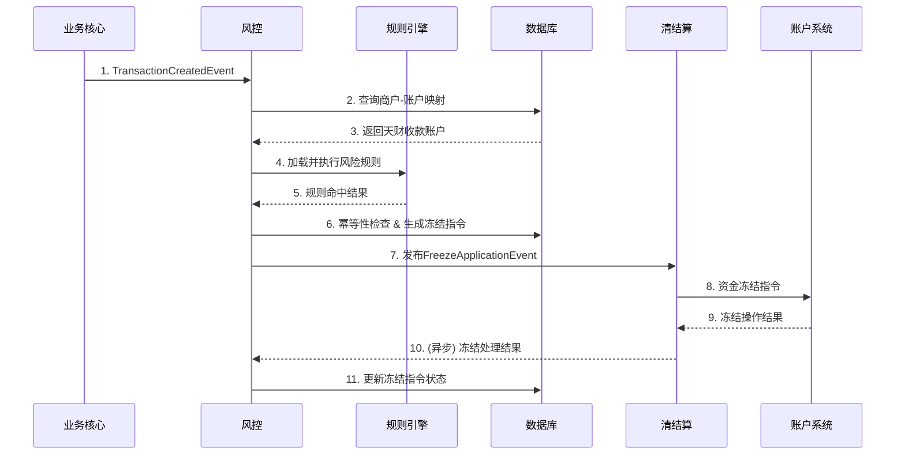

# 模块设计: 风控

生成时间: 2026-01-22 16:16:50
批判迭代: 2

---

# 模块设计: 风控

## 1. 概述
- **目的与范围**: 本模块负责判定交易或商户风险，并发起冻结指令。其核心职责是接收来自业务系统（如业务核心）的风险判定请求，或主动监控交易与商户状态，在识别到风险后，向清结算模块发起对账户资金的冻结申请。其边界在于风险规则的执行与冻结指令的生成，不直接操作账户资金，也不处理冻结指令的执行结果。根据术语表，本模块发起的"交易冻结"和"商户冻结"流程，其最终冻结目标为"天财收款账户"。

## 2. 接口设计
- **API端点 (REST)**:
    - `POST /api/v1/risk/transaction/check`: 用于交易风险判定。
    - `POST /api/v1/risk/merchant/freeze/apply`: 用于商户冻结申请。
    - `GET /api/v1/risk/rules`: 查询生效的风险规则列表。
    - `POST /api/v1/risk/rules/reload`: 触发风险规则热重载。
- **请求/响应结构**:
    - 交易风险判定请求体 (`TransactionRiskCheckRequest`): 交易流水号、交易金额、付方机构号、收方机构号、商户ID、交易时间、业务类型。
    - 交易风险判定响应体 (`TransactionRiskCheckResponse`): 风险判定结果（通过/拒绝/需人工审核）、风险等级、命中规则ID列表、建议动作。
    - 商户冻结申请请求体 (`MerchantFreezeApplyRequest`): 商户ID、机构号、冻结原因码、申请冻结金额、申请操作员、幂等键。
    - 商户冻结申请响应体 (`MerchantFreezeApplyResponse`): 申请结果（成功/失败）、风控指令号、失败原因。
- **发布/消费的事件**:
    - 消费事件:
        - `TransactionCreatedEvent` (来自业务核心): 包含交易数据，用于触发交易风险判定。
        - `RiskAlertEvent` (来自其他监控系统): 包含风险告警信息，可能触发商户冻结流程。
    - 发布事件:
        - `FreezeApplicationEvent` (发布至清结算): 包含风控指令号、目标账户号、冻结金额、冻结原因，以触发资金冻结。

## 3. 数据模型
- **表/集合**:
    - 风险规则表 (`risk_rule`)
    - 风险判定记录表 (`risk_judgment_record`)
    - 冻结指令表 (`freeze_order`)
    - 商户-账户映射表 (`merchant_account_mapping`)
- **关键字段**:
    - `risk_rule`: 规则ID、规则名称、规则类型（交易/商户）、规则条件（JSON格式）、风险等级、动作（告警/冻结/人工审核）、优先级、生效状态、最后更新时间。
    - `risk_judgment_record`: 记录ID、关联业务流水号、商户ID、规则ID、判定结果（通过/拒绝/风险）、风险详情、判定时间、触发动作。
    - `freeze_order`: 指令号、目标账户号、目标商户ID、关联业务流水号（可选）、申请冻结金额、冻结原因、指令状态（已生成/已发送/处理成功/处理失败）、风控规则ID、幂等键、创建时间、更新时间。
    - `merchant_account_mapping`: 映射ID、商户ID、机构号、账户号（天财收款账户）、账户状态、生效时间。
- **与其他模块的关系**: 本模块的冻结指令通过目标账户号与"账户系统"管理的账户关联；冻结指令的执行状态与"清结算"模块的冻结申请处理结果关联；风险判定记录与"业务核心"的交易数据通过业务流水号关联；商户-账户映射表用于根据商户ID和机构号查询对应的"天财收款账户"。

## 4. 业务逻辑
- **核心工作流/算法**:
    1.  **交易冻结流程**:
        - 接收业务核心的`TransactionCreatedEvent`事件。
        - 根据事件中的商户ID和机构号，查询`merchant_account_mapping`表，获取对应的"天财收款账户"作为潜在冻结目标。若未找到，记录错误并终止流程。
        - 加载所有生效的、类型为"交易"的风险规则，按优先级排序。
        - 将交易数据依次与规则条件进行匹配（规则引擎执行）。
        - 若规则命中且动作为"冻结"，则根据业务流水号检查`freeze_order`表，确保无重复指令（幂等性校验）。
        - 生成冻结指令，状态为"已生成"，并记录至`freeze_order`表。
        - 向"清结算"模块发布`FreezeApplicationEvent`事件，指令状态更新为"已发送"。
        - （异步）接收清结算返回的处理结果，更新指令状态为"处理成功"或"处理失败"。
    2.  **商户冻结流程**:
        - 通过API调用或消费`RiskAlertEvent`事件发起商户冻结。
        - 根据请求中的商户ID和机构号，查询`merchant_account_mapping`表，获取对应的"天财收款账户"。若未找到，返回错误。
        - 根据请求中的幂等键，检查`freeze_order`表，防止重复申请。
        - 生成冻结指令并记录。
        - 向"清结算"模块发布`FreezeApplicationEvent`事件。
    3.  **风险规则管理**:
        - 规则存储在`risk_rule`表中，规则条件为JSON格式，可由规则引擎解析。
        - 支持规则的热重载。管理员通过`POST /api/v1/risk/rules/reload`接口触发，系统重新从数据库加载所有规则至内存缓存。
        - 规则执行采用优先级机制，高优先级规则先执行，一旦命中"冻结"动作，可配置是否跳过后续规则。
- **业务规则与验证**:
    - 执行风险规则前，校验输入数据的完整性与合法性。
    - 生成冻结指令前，必须确认目标"天财收款账户"存在且状态正常（通过查询`merchant_account_mapping`及与账户系统交互确认）。
    - 所有冻结申请必须携带幂等键（如业务流水号或由商户ID+时间戳+序列号生成），确保同一业务在短时间内不会被重复冻结。
- **关键边界情况处理**:
    - 风险规则引擎执行失败：记录错误日志，并触发降级策略（如转为人工审核），同时告警。
    - 无法找到交易/商户对应的天财收款账户：终止冻结流程，记录失败原因并告警。
    - 向清结算发送冻结申请事件失败：进行有限次重试，若最终失败则更新指令状态为"处理失败"并告警。
    - 接收来自其他监控系统的`RiskAlertEvent`：解析事件，提取商户信息，并入商户冻结流程。

## 5. 时序图

## 6. 错误处理
- **预期错误情况**:
    1.  输入数据错误：请求数据格式错误、缺失关键字段（如商户ID、机构号）。
    2.  依赖数据缺失：查询`merchant_account_mapping`表未找到对应账户。
    3.  内部服务异常：风险规则引擎加载或执行异常；数据库连接或操作失败。
    4.  外部依赖故障：向清结算模块发布事件失败；清结算处理超时或返回失败。
    5.  幂等冲突：检测到重复的业务流水号或幂等键。
- **处理策略**:
    - 对输入数据校验失败，立即返回400错误响应，并记录日志。
    - 对依赖数据缺失（如找不到账户），终止当前流程，返回明确的业务错误码，并触发告警通知运营人员。
    - 对规则引擎等内部组件故障，捕获异常，记录错误日志，触发降级策略（如放行交易并标记为"需人工审核"），同时发送系统告警。
    - 对清结算事件发布失败，采用重试机制（如最多3次），重试后仍失败则更新指令状态为"处理失败"，记录日志并告警。
    - 检测到幂等冲突时，查询已存在的指令状态，并返回对应的处理结果，确保业务幂等。
    - 所有错误处理均需保证关键状态（如指令状态）的准确更新，并提供完整的错误上下文日志用于排查。

## 7. 依赖关系
- **上游模块**:
    - 业务核心：提供需要进行风险判定的交易数据或事件 (`TransactionCreatedEvent`)。
    - 其他监控系统：提供风险告警事件 (`RiskAlertEvent`)，作为商户冻结的触发源之一。
- **下游模块**:
    - 清结算：消费本模块发布的`FreezeApplicationEvent`，并协调"账户系统"执行实际的账户资金冻结操作。
    - 账户系统：通过清结算间接依赖，用于验证目标账户状态（可选，可通过缓存或映射表实现初步校验）。