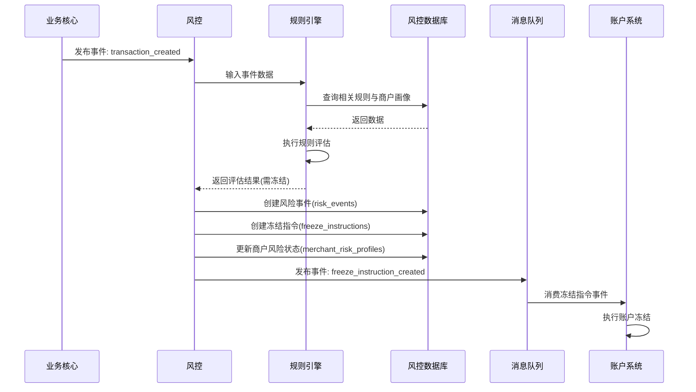

# 模块设计: 风控

生成时间: 2026-01-22 17:48:05
批判迭代: 2

---

# 风控模块设计文档

## 1. 概述
- **目的与范围**: 本模块负责对交易、商户及账户进行实时与离线的风险监控、判定，并基于判定结果发起冻结指令。其核心职责包括风险规则与模型的管理、风险事件的评估、以及冻结/解冻指令的生成与发布。模块边界止于风险指令的发起，不包含指令在账户系统或清结算系统中的具体执行。

## 2. 接口设计
- **API端点 (REST)**:
    - `POST /api/v1/risk/assessment/manual`: 手动触发对指定商户或交易的风险评估。
    - `GET /api/v1/risk/rules`: 查询当前生效的风险规则列表。
    - `POST /api/v1/risk/rules`: 创建新的风险规则（需授权）。
    - `PUT /api/v1/risk/rules/{ruleId}`: 更新指定风险规则（需授权）。
    - `POST /api/v1/freeze/manual`: 人工发起冻结指令（覆盖自动风控）。
    - `POST /api/v1/unfreeze/request`: 发起解冻申请（需审核）。
- **请求/响应结构**: TBD（需与调用方协商定义具体字段，如商户ID、交易号、冻结原因、申请备注等）。
- **发布/消费的事件**:
    - **发布的事件**:
        - `freeze_instruction_created`: 冻结指令已创建（包含指令ID、目标类型、目标ID、冻结原因、操作类型）。
        - `unfreeze_request_created`: 解冻申请已提交（包含申请ID、目标类型、目标ID、申请原因）。
    - **消费的事件**:
        - `transaction_created` (来自业务核心): 用于实时交易风险监控。
        - `settlement_completed` (来自清结算): 用于结算后资金风险监控。
        - `reconciliation_discrepancy` (来自对账单系统): 用于对账差异引发的风险判定。

## 3. 数据模型
- **表/集合**:
    - `risk_rules`: 风险规则定义表。
        - 关键字段: `rule_id`, `rule_name`, `rule_type` (实时/批量), `trigger_condition` (JSON), `action` (冻结/告警), `target_type` (商户/交易/账户), `priority`, `is_active`, `created_at`, `updated_by`。
    - `risk_events`: 风险事件记录表。
        - 关键字段: `event_id`, `trigger_source` (交易/结算/对账), `source_id`, `target_id`, `target_type`, `rule_id`, `risk_score`, `risk_level`, `event_data` (快照), `status` (待处理/已判定/已忽略), `created_at`。
    - `freeze_instructions`: 冻结指令表。
        - 关键字段: `instruction_id`, `target_type` (商户/交易), `target_id`, `freeze_type` (账户冻结/交易冻结), `reason`, `related_event_id`, `status` (已创建/已发送/已确认), `created_by` (系统/人工), `created_at`。
    - `merchant_risk_profiles`: 商户风险画像表。
        - 关键字段: `merchant_id`, `risk_level`, `last_risk_assessment_time`, `total_freeze_count`, `current_freeze_status`, `freeze_reason`, `frozen_until`, `profile_data` (JSON，存储行为指标), `updated_at`。
- **与其他模块的关系**: 风控模块通过`freeze_instructions`表记录发起的指令，并通过事件通知下游系统（账户系统、清结算）。`risk_events`表关联来自上游模块（业务核心、清结算、对账单系统）的数据源。

## 4. 业务逻辑
- **核心工作流/算法**:
    1. **规则管理与触发**:
        - 规则存储在`risk_rules`表中，支持实时规则（基于事件触发）和批量规则（定时任务扫描）。
        - 实时规则通过消费上游事件（如交易创建）触发评估。
        - 批量规则由调度任务定期执行，扫描历史数据（如商户单日交易额突增）。
    2. **风险判定**:
        - 事件触发后，调用规则引擎对输入数据（事件数据、商户画像）进行匹配与评分。
        - 生成`risk_events`记录，并根据规则配置的`action`决定后续操作（生成冻结指令或仅告警）。
    3. **指令发起与状态管理**:
        - 对于需冻结的情况，创建`freeze_instructions`记录，状态为“已创建”。
        - 发布`freeze_instruction_created`事件，由账户系统或清结算消费并执行。
        - 支持通过回调或事件确认更新指令状态为“已确认”。
    4. **解冻流程**:
        - 支持人工提交解冻申请（`POST /api/v1/unfreeze/request`），生成待审核任务。
        - 审核通过后，生成解冻指令（视为一种特殊的冻结指令，操作类型为“解冻”）并发布事件。
- **业务规则与验证**:
    - 冻结指令需幂等：通过`instruction_id`或`(target_type, target_id, freeze_type)`唯一键确保不会对同一目标重复创建有效的冻结指令。
    - 解冻申请需关联原冻结记录，并经过授权审核。
- **关键边界情况处理**:
    - **对已冻结目标的重复冻结**: 在创建指令前，检查`merchant_risk_profiles.current_freeze_status`或相关交易状态。若已冻结，则忽略或记录日志，不重复创建指令。
    - **风险判定数据不完整或延迟**: 设置规则评估超时与熔断机制。若核心数据（如交易金额）缺失，则判定结果为“数据不足”，风险事件状态为“已忽略”，并触发告警通知人工介入。
    - **冻结状态与有效期**: 冻结指令可包含`frozen_until`字段（在`merchant_risk_profiles`中体现）。过期后，需有定时任务自动发起解冻评估或通知人工复审。

## 5. 时序图

## 6. 错误处理
- **预期错误情况**:
    1. **规则引擎故障**: 规则解析或执行异常。
    2. **数据源访问失败**: 查询内部数据库或依赖上游服务超时/失败。
    3. **指令发布失败**: 向消息队列发布事件失败。
    4. **数据不一致**: 风险判定依赖的核心数据（如账户状态）与实际不一致。
- **处理策略**:
    - **规则引擎故障**: 捕获异常，记录错误日志并触发严重告警。当前风险事件判定中止，标记为“系统错误”，降级为人工审核流程。
    - **数据源访问失败**: 实现重试与熔断机制。若查询商户画像失败，可使用默认风险等级进行评估，并在风险事件中标记“数据源降级”。
    - **指令发布失败**: 采用本地事务与异步重试队列。确保`freeze_instructions`记录创建后，指令发布有至少一次（at-least-once）保证。
    - **数据不一致**: 在关键操作（如创建冻结指令）前，进行二次校验（如调用账户系统快照接口）。若状态已变更，则根据新状态决定是否继续。

## 7. 依赖关系
- **上游模块/数据源**:
    - **业务核心**: 提供实时交易数据，是实时风险监控的主要数据源。
    - **清结算**: 提供结算完成事件及结算明细，用于监控资金结算环节的风险。
    - **对账单系统**: 提供对账差异事件，用于识别交易与资金不匹配的风险。
- **下游模块**:
    - **账户系统**: 消费冻结指令事件，执行对底层账户的冻结/解冻操作。
    - **清结算**: 消费交易冻结指令，在清分结算环节对特定交易资金进行拦截或暂缓处理。
- **内部依赖**:
    - 规则引擎组件（可内嵌或独立服务）。
    - 消息队列/事件总线（用于内部事件驱动及对外通信）。